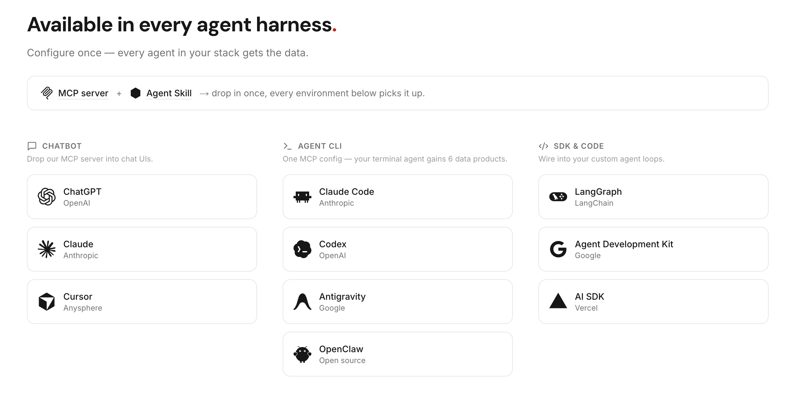
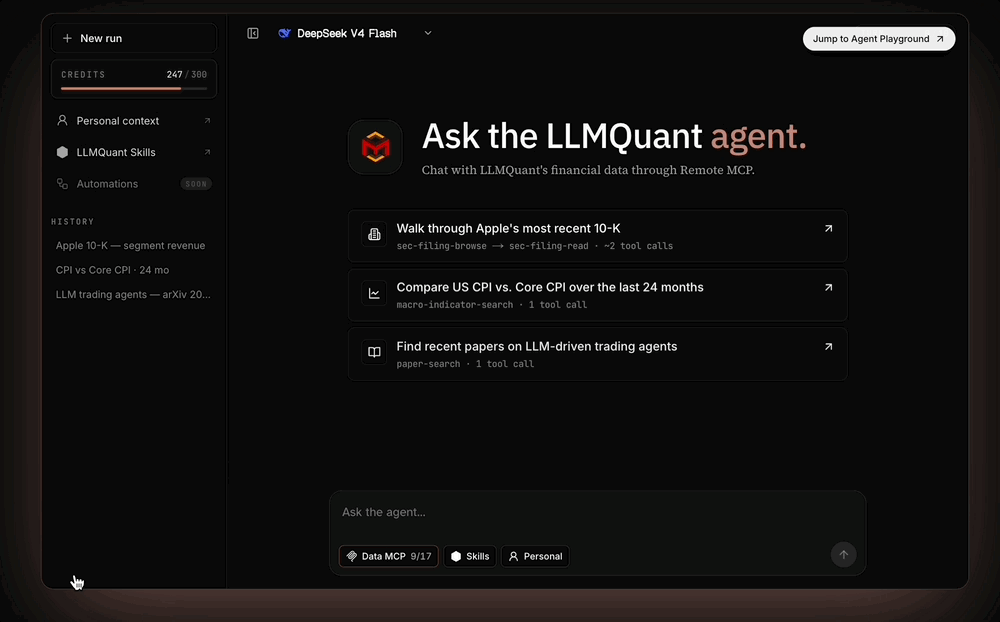

<div align="center">


<h1>LLMQuant Skills</h1>

<p><strong>Reusable finance Agent Skills — grounded in <a href="https://github.com/LLMQuant/data-mcp">LLMQuant Data</a></strong></p>

<p><strong>English</strong> · <a href="README.zh-CN.md">简体中文</a></p>

<p>
  <a href="https://github.com/LLMQuant/skills/stargazers"></a>
  <a href="LICENSE"></a>
  <a href="https://github.com/LLMQuant/data-mcp"></a>
  <a href="https://llmquantdata.com/agent"></a>
  <a href="https://github.com/LLMQuant/skills/commits"></a>
</p>

</div>

```bash
npx skills add LLMQuant/skills      # Claude Code · Codex · Cursor · Antigravity · OpenClaw · Hermes · …
```

> [!TIP]
> 18 category skills — equities, options, macro, crypto, credit, portfolio, risk, and more — that route an agent to the right finance workflow and keep every claim grounded in LLMQuant Data.

## Contents

- [Contents](#contents)
- [Overview](#overview)
- [Category Skills](#category-skills)
- [Install](#install)
  - [Recommended: `npx skills add`](#recommended-npx-skills-add)
  - [Native plugin install](#native-plugin-install)
- [LLMQuant Data](#llmquant-data)
- [Contributing](#contributing)
- [License](#license)
- [Star History](#star-history)

## Overview

<div align="center">
  
</div>


This repository is a **skill catalog**. The install/import unit is a category folder under `skills/llmquant-*` — each one a router `SKILL.md` that indexes `workflows/*.md`, tells the agent which workflow to load, and enforces the LLMQuant Data evidence contract. It is not an isolated `SKILL.md` and not a single workflow file.

<details>
<summary><strong>Repository layout</strong></summary>

```text
skills/
├── llmquant-data/
│   ├── SKILL.md
│   ├── workflows/
│   ├── scripts/
│   └── assets/
├── llmquant-etfs/
│   ├── SKILL.md
│   └── workflows/
└── ...

.claude-plugin/     # Claude Code plugin + marketplace manifests
.codex-plugin/      # Codex plugin manifest
.cursor-plugin/     # Cursor plugin manifest
assets/
README.md
README.zh-CN.md
```

</details>

## Category Skills

| Skill | Scope | Key workflows |
|---|---|---|
| [`llmquant-data`](skills/llmquant-data) | LLMQuant Data primitives and source-grounded research. | 10-K risk review, 13F holders, U.S. macro snapshot, macro brief |
| [`llmquant-equities`](skills/llmquant-equities) | Equity research, comparison, valuation, catalysts, and sell discipline. | Five-lens analysis, equity compare, research memo, merger arb, take-profit lab |
| [`llmquant-etfs`](skills/llmquant-etfs) | ETF holdings, overlap, concentration, and exposure analysis. | ETF overlap report |
| [`llmquant-options`](skills/llmquant-options) | Options, volatility, Greeks, unusual activity, and option backtests. | IV rank, strategy builder, Greeks dashboard, P&L simulator, volatility surface |
| [`llmquant-equity-derivatives`](skills/llmquant-equity-derivatives) | Single-stock derivative and hybrid security research. | Single-stock derivative playbook, convertible and warrant lens |
| [`llmquant-commodities`](skills/llmquant-commodities) | Commodity spot, futures curve, inventory, and macro linkage work. | Commodity market lens, futures curve monitor |
| [`llmquant-crypto`](skills/llmquant-crypto) | Crypto regime, token research, perpetual funding, basis, and leverage monitoring. | Crypto market regime, token research, perp funding monitor |
| [`llmquant-prediction-markets`](skills/llmquant-prediction-markets) | Event odds, prediction-market contracts, probability gaps, and cross-venue arb review. | Event probability brief, arb watch, probability vs options pricing |
| [`llmquant-macro`](skills/llmquant-macro) | Macro dashboards, central-bank previews, liquidity, growth, inflation, and portfolio impact. | Global macro dashboard, Fed policy preview, macro-to-portfolio impact |
| [`llmquant-credit`](skills/llmquant-credit) | Issuer credit, spread regimes, high-yield stress, refinancing, and default risk. | Issuer credit risk review, credit spread regime, high-yield stress monitor |
| [`llmquant-rates-fx`](skills/llmquant-rates-fx) | Rates, yield curves, central-bank divergence, FX carry, and currency risk. | Yield curve trade lens, central-bank divergence, FX carry dashboard |
| [`llmquant-events`](skills/llmquant-events) | Earnings, M&A, regulatory, legal, policy, and catalyst event monitoring. | Earnings event brief, M&A event tracker, regulatory risk monitor |
| [`llmquant-portfolio`](skills/llmquant-portfolio) | Company profiles, thesis tracking, watchlists, alerts, and themes. | Company profile, thesis tracker, theme research, watchlist monitor, alert manager |
| [`llmquant-portfolio-lab`](skills/llmquant-portfolio-lab) | Portfolio exposure maps, what-if simulations, and virtual portfolio states. | Portfolio exposure map, portfolio what-if simulator |
| [`llmquant-risk`](skills/llmquant-risk) | Risk regime, hedging, panic scoring, and research quality checks. | Fear score, VIX status, hedge advisor, research health check |
| [`llmquant-strategies`](skills/llmquant-strategies) | Hedge-fund and PM strategy playbooks. | Equity long/short, long-biased, event-driven, macro, quant, multi-strategy |
| [`llmquant-market-intelligence`](skills/llmquant-market-intelligence) | Reusable market utilities and signal views. | Macro view, market sentiment, event probability signals |
| [`llmquant-investor-lenses`](skills/llmquant-investor-lenses) | Investor-style reasoning overlays using LLMQuant Data evidence. | Buffett, Graham, Munger, Lynch, Fisher, Burry, Ackman, Damodaran, and more |

## Install

### Recommended: `npx skills add`

One command, and it works across Claude Code, Codex, Cursor, Antigravity, Gemini, and other agents.

> [!TIP]
> Already inside an agent? Just run `npx skills add LLMQuant/skills` — it auto-detects the host and installs to the right place.

```bash
# Pick skills interactively for the current agent
npx skills add LLMQuant/skills

# Install all category skills globally
npx skills add LLMQuant/skills -g --all

# Install specific skills
npx skills add LLMQuant/skills -g --skill llmquant-options llmquant-equities

# Target a specific agent
npx skills add LLMQuant/skills -a codex
```

Manage installed skills with `npx skills list`, `npx skills update`, and `npx skills remove`. Then ask the agent `What skills are available?`, or invoke one directly, e.g. `/llmquant-options`.

<div align="center">
  
</div>

### Native plugin install

The whole repository is also packaged as a single plugin that bundles every category skill, for agents with a native plugin system.

**Claude Code** — add this repo as a plugin marketplace, then install the bundle:

```text
/plugin marketplace add LLMQuant/skills
/plugin install llmquant-skills@llmquant
```

**Codex** — the repo ships `.codex-plugin/plugin.json`, so it is plugin-ready. To install today, use the CLI above (`npx skills add LLMQuant/skills -a codex`), or install a single category skill via the skill installer:

```text
$skill-installer install https://github.com/LLMQuant/skills/tree/main/skills/llmquant-options
```

**Cursor · Antigravity · other agents** — use the recommended CLI with the matching agent, e.g. `npx skills add LLMQuant/skills -a cursor` or `-a antigravity`.

## LLMQuant Data

These skills are the workflow layer for **[LLMQuant Data](https://github.com/LLMQuant/data-mcp)** — one MCP server that feeds prices, filings, 13F, macro, ETF holdings, crypto, and more to your agents. **Configure once, and every agent in your stack gets the data.**

<div align="center">
  
</div>

**Set it up the AI-native way** — paste this to your agent:

```text
Install the LLMQuant data-mcp server in this environment by following https://github.com/LLMQuant/data-mcp
```

Or add it by hand:

```bash
claude mcp add llmquant-data -e LLMQUANT_API_KEY=your_api_key -- npx -y @llmquant/data-mcp
```

> [!NOTE]
> Grab an API key and the full multi-agent setup at **[docs.llmquantdata.com](https://docs.llmquantdata.com)** and **[`LLMQuant/data-mcp`](https://github.com/LLMQuant/data-mcp)**.

Skills describe the data they need in natural language and let the agent route to whatever LLMQuant Data exposes, so coverage can grow without editing any skill. Without `llmquant-data` connected, skills still run as reusable workflows — the agent asks for user-provided data and clearly labels anything missing. The full evidence contract is in [CONTRIBUTING.md](CONTRIBUTING.md).

<div align="center">
  <a href="https://llmquantdata.com/agent"></a>
  <br/>
  <strong><a href="https://llmquantdata.com/agent">Open the LLMQuant Agent Playground →</a></strong>
</div>

<details>
<summary><strong>▶ Watch the playground demo</strong></summary>
<br/>
<div align="center">
  
</div>
</details>

## Contributing

Add or update workflows inside the relevant category (`skills/llmquant-<category>/` → `SKILL.md` + `workflows/` + `scripts/` + `assets/`):

- Category folders must be named `llmquant-*`, and `SKILL.md` is the router that indexes every workflow.
- Workflow files hold the repeatable procedure, output format, data contract, and guardrails.
- Describe data needs as natural-language capabilities, not exact MCP tool names.
- Update this README when a category or major workflow is added, removed, or renamed.

See [CONTRIBUTING.md](CONTRIBUTING.md) for the full contract and quality bar.

## License

MIT — see [LICENSE](LICENSE). Listing a project here does not change the license of any linked code or artifact.

<div align="center">
  <br/>
  
  <br/><br/>
  <strong><a href="https://llmquant.com">LLMQuant</a></strong>
  <br/>
  <sub>Open-source community for AI, LLMs, and quantitative finance.</sub>
  <br/><br/>
  <a href="https://llmquant.com">Website</a> ·
  <a href="https://github.com/LLMQuant">GitHub</a> ·
  <a href="https://linkedin.com/company/llmquant">LinkedIn</a>
</div>

## Star History

[](https://www.star-history.com/#LLMQuant/skills&Date)
