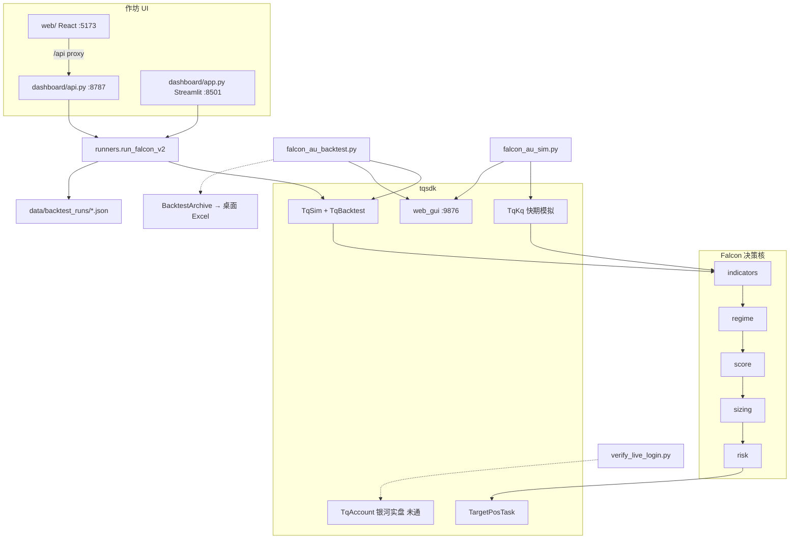

# IgniteQuant 架构说明书（供 AI / 人工审阅）

> **用途**：把本仓库的核心逻辑、边界与已知债一次性讲清楚，便于 AI 或架构师审视并提出改进建议。  
> **不是**：策略交易说明书（桌面另有 `Falcon_v2_沪金策略说明.md`）；也不是逐步操作手册（见根目录 `Ruler.md`）。  
> **审阅方式**：读完本文后，按文末「审阅提示词」输出结构化建议即可；改代码前先对齐优先级。

**仓库**：https://github.com/hawk1949-rs/IgniteQuant  
**定位**：家庭量化作坊 —— 以天勤 `tqsdk` 做期货策略实验，主策略为 Falcon v2（沪金），外挂回测看板与 Agent Skills 研究层。  
**文档日期**：2026-07-17（与当前代码对齐）

---

## 1. 一句话架构

```
研究层(Agent Skills / LLMQuant MCP)
        ↓ 不进交易热路径
作坊层(React web ↔ FastAPI / Streamlit) → JSON 回测档案
        ↓ 调用
执行层(tqsdk 事件循环)
        ↓
决策核(strategies/falcon/*) → TargetPosTask 目标净仓
```

系统边界清晰：**决策核可复用**；回测 / 模拟盘 / 看板 runner 目前是三份近乎复制的主循环；实盘入口尚未产品化。

---

## 2. 目标与非目标

| 目标 | 非目标（当前） |
| --- | --- |
| 可复现的 Falcon 信号 + 风控闭环 | 多品种组合优化 / 资金曲线归因引擎 |
| 本地回测 → 快期模拟 →（未来）银河实盘 | 云端调度、多账户并发、微服务化 |
| 家庭作坊式对比多跑次、打分与笔记 | 机构级 OMS / 风控中台 |
| 可选桌面 Excel 对账单 | 实时行情二次存储 / 自研图表 |

---

## 3. 目录地图（只列核心）

| 路径 | 职责 | 是否交易热路径 |
| --- | --- | --- |
| `strategies/falcon/` | 指标 / 行情状态 / 评分 / 手数 / 风控 | ✅ 决策核 |
| `strategies/falcon_au_backtest.py` | `TqSim` + `TqBacktest` CLI 回测 | ✅ |
| `strategies/falcon_au_sim.py` | `TqKq` 快期模拟盘 | ✅ |
| `strategies/vwap_au_backtest.py` | 独立 VWAP 示例（未接入看板） | ✅ 旁路 |
| `dashboard/` | catalog / runners / scoring / store + Streamlit + FastAPI | 半热（调 runner） |
| `web/` | Vite React 主前端（Magic UI） | ❌ UI |
| `common/backtest_archive.py` | 可选桌面 Excel 存档 | 旁路 |
| `data/backtest_runs/*.json` | 看板跑次持久化 | 数据 |
| `Ruler.md` | 开发约定与运维备忘 | 文档 |
| `.agents/skills/`、`LLMQuant-skills/`、`apple-design-skill/` | Cursor Skills 研究/设计辅助 | ❌ |
| `.env`（gitignore） | TQ / LLMQuant 凭证 | 配置 |

根目录无统一 `src/` 包：脚本把仓库根与 `strategies/` 插入 `sys.path` 后 `import falcon`。

---

## 4. 运行时拓扑



**端口约定**

| 服务 | 端口 |
| --- | --- |
| tqsdk 策略 K 线 UI | `127.0.0.1:9876`（必须 `web_gui=":9876"`，禁止随机端口） |
| FastAPI | `8787` |
| React | `5173` |
| Streamlit 备用 | `8501` |

回测结束后必须继续 `api.wait_update()` 保活 UI；禁止用纯 `time.sleep` 阻塞事件循环。

---

## 5. Falcon 决策核（核心逻辑）

### 5.1 模块职责

| 模块 | 函数 / 类 | 输入 | 输出 | 关键参数 |
| --- | --- | --- | --- | --- |
| `indicators.py` | `compute_indicators(klines)` | tqsdk K 线 DataFrame | `IndicatorBundle`（ma/atr/adx/kdj/vol…） | MA7/14/52，ATR(14)，ADX(14)，KDJ(9,3,3)，量 MA20 |
| `regime.py` | `detect_regime(ind)` | 指标 | `TREND_UP` / `TREND_DOWN` / `RANGE` | ADX≥25；方向看 close vs MA52 |
| `score.py` | `score_signal(ind)` | 指标 | `ScoreDetail`，`signal ∈ [-3,3]` | 格兰维尔 + 放量 + KDJ；冲突惩罚 |
| `sizing.py` | `lots_from_signal(signal, regime)` | 信号 + 行情状态 | 目标净仓 `int` 或 `None`（不改仓） | `LOT_BY_SIGNAL={1:1,2:1,3:1}`，`LOT_SCALE` |
| `risk.py` | `RiskManager` | 持仓与 K 线高低收 | `STOP_LOSS` / `TAKE_PROFIT` / 冷却 | **入口实际** sl=1.3、tp=2.3、cooldown=4 根 K（类默认值不同，见债项） |

公开导出：`strategies/falcon/__init__.py`。

### 5.2 每根新 K 的控制流

触发条件：`api.is_changing(klines.iloc[-1], "datetime")`（**收盘驱动**，非整秒 tick 驱动）。

```
订阅 SIGNAL=KQ.m@SHFE.au，KLINE_SECONDS=300（5 分钟），data_length≈400
  → quote.underlying_symbol 换月？先 TargetPosTask(旧)=0，再切新合约
  → compute_indicators
  → detect_regime + score_signal
  → risk.tick_cooldown
  → [仅回测] date ≥ FLAT_DATE → 强制目标仓=0
  → 若有持仓：risk.check(high/low/close) → 触发则平仓并进入冷却
  → 若在冷却：跳过开仓逻辑
  → desired = lots_from_signal(...)
       None 或 == current → 不动
       否则 set_target_volume(desired) + on_entry/on_flat
```

**仓位语义**：始终是 **目标净仓**（`TargetPosTask`），不是手写报单队列。  
**RANGE / 信号与趋势反向 / signal=0**：`lots_from_signal` 返回 `None` → **不主动改仓**（已有仓位仍可被风控平掉）。

### 5.3 三条执行入口（同构、未 DRY）

| 入口 | 账户 | 差异点 |
| --- | --- | --- |
| `falcon_au_backtest.py` | `TqSim` + `TqBacktest` | 区间、期末强平、可选 Excel、结束后保活 UI |
| `falcon_au_sim.py` | `TqKq` | 实时；启动时评估最新 K；60s 心跳；Ctrl+C 可平仓退出 |
| `dashboard/runners.run_falcon_v2` | `TqSim`，`web_gui=False` | 为看板批量对比；不写 Excel；返回 metrics |

### 5.4 当前关键常量

| 常量 | 值 | 含义 |
| --- | --- | --- |
| `KLINE_SECONDS` | `300` | 5 分钟（由 1H 迁来，参数尚未按新周期重标定） |
| `INIT_BALANCE` | `1_000_000` | 回测初始资金 |
| `LOT_BY_SIGNAL` | 全为 1 | 信号强度几乎不进仓位尺寸 |
| ATR 止损 / 止盈 | 1.3× / 2.3× | 入口显式传入 |
| `cooldown_bars` | 4 | 止盈止损后冷却 4 根 5m K ≈ 20 分钟 |
| 默认回测区间 | 2025-01-01 ~ 2025-02-28 | CLI 与 API 默认一致 |
| 信号合约 | `KQ.m@SHFE.au` | 连续；**不可**用 TqSim 直接下单 |
| 交易合约 | `underlying_symbol` | 如 `SHFE.au2608` |

---

## 6. 作坊层（看板）

```
catalog.STRATEGIES / SYMBOLS
        ↓
runners.run_falcon_v2 → tqsdk metrics
        ↓
scoring.score_metrics → scorecard（0–100，A–E）+ tips
        ↓
store → data/backtest_runs/{run_id}.json
```

- **品种**：沪金 / 沪银 / 沪铜（目录可扩；逻辑仍是同一 Falcon）
- **VWAP**：目录占位 `run_vwap_stub` → `NotImplementedError`
- **打分权重**：收益 25 / 回撤 25 / 夏普 20 / 胜率·盈亏比 20 / 样本量 10  
  返回字段名：`score`、`review_tips`（前端若写 `total`/`tips` 需对齐）
- **API**：`/api/catalog` `/api/runs` `/api/backtest` + 笔记 PATCH / 删除 DELETE
- **长回测**：同步阻塞 HTTP/Streamlit 请求（无任务队列）

---

## 7. 配置与外部依赖

| 依赖 | 用途 |
| --- | --- |
| `tqsdk` | 行情、回测、下单、Web UI |
| `openpyxl` | Excel 存档 |
| `fastapi` / `uvicorn` / `pydantic` | 看板 API |
| `streamlit` / `pandas` | 备用看板 |
| `web/` npm 栈 | React 前端 |

**密钥（仅 `.env`）**：`TQ_USER`/`TQ_PASS`（必需）；`TQ_FUTURE_*`（实盘）；`LLMQUANT_API_KEY`（研究 MCP，非交易）。

**账户阶梯**：`TqSim`（回测）→ `TqKq`（已验证）→ `TqAccount("Y银河期货", …)`（穿透式白名单未开通，阻塞实盘）。

---

## 8. 已知约束与技术债（审阅重点）

1. **主循环三重复制**：backtest / sim / runner 参数易漂移 → 建议抽 `FalconEngine` / 共享 `on_bar`。
2. **5 分钟未重标定**：MA52/ADX25/ATR 倍数/冷却根数从更长周期沿用 → 信号过密或失效风险。
3. **手数扁平**：`LOT_BY_SIGNAL` 全 1，强度维度浪费。
4. **Risk 默认值 vs 调用值不一致**：类默认 1.5/2.5/3，生产写死 1.3/2.3/4。
5. **实盘未产品化**：无统一 live 入口；白名单外不可登录。
6. **看板同步阻塞**：长区间 5m 回测会卡住 API。
7. **前后端字段小裂痕**：scorecard 字段命名需统一。
8. **研究层与交易层耦合弱**（好事），但尚无「研究结论 → 参数变更」的正式闭环。

---

## 9. 设计不变量（改架构时勿轻易破坏）

1. 信号用连续合约，交易用具体交割月；换月先平旧再切新。
2. 只在 **K 线 datetime 变化（收盘）** 调仓；盘中心跳不调仓。
3. `RANGE` 不开新仓；风控可强平。
4. 带 UI 的 tqsdk 进程固定 `:9876`，结束用 `wait_update` 保活。
5. 密钥永不进 Git；Public 仓库。

---

## 10. 给 AI 的审阅提示词（可直接复制）

请基于本文（及必要时打开的源码路径）做架构审阅，输出：

1. **架构健康度**：一句话评价 + 1–10 分  
2. **Critical / High / Medium / Low** 问题列表；每条含：现象、为何危险、建议改法、涉及路径  
3. **优先重构路线图**（最多 5 步，按性价比排序）  
4. **策略参数风险**：针对「1H→5m 未重标定」与「扁平手数」单独给意见  
5. **不要做的事**：列出当前阶段应避免的过度设计  
6. 假设场景是 **单人家庭作坊 + 沪金为主 + 先模拟后实盘**，建议需匹配该约束

可选深入阅读：

- `strategies/falcon/*.py`
- `strategies/falcon_au_sim.py` / `falcon_au_backtest.py`
- `dashboard/runners.py` / `api.py` / `scoring.py`
- `common/backtest_archive.py`
- `Ruler.md`

---

## 11. 变更记录

| 日期 | 说明 |
| --- | --- |
| 2026-07-17 | 初版：Falcon 决策核 + 作坊三前端 + 已知债；K 线已切 5 分钟 |
