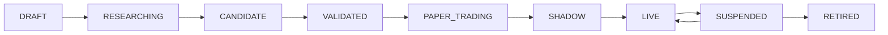

# IgniteQuant 收敛版产品需求文档（Lean PRD）

> **产品名称**：IgniteQuant  
> **产品定位**：个人量化策略全生命周期研究、运行和风险管理系统  
> **文档版本**：v2.0 Lean  
> **文档日期**：2026-07-18  
> **适用对象**：产品设计、Cursor Agents、Codex Agents、前后端开发者  
> **MVP范围**：M0—M3  
> **默认环境**：回测与模拟盘；未经明确授权禁止连接真实账户或发送真实委托

---

## 0. 本版相对上一版的收敛决策

本版不再按“功能越多越完整”的方式组织产品，而是围绕一条可以真正运行的用户闭环：

```text
创建策略版本
→ 发起可复现回测
→ 统一口径比较
→ 选择候选版本
→ 部署模拟盘
→ 查看决策、仓位和成交
→ 风险干预
→ 诊断偏差
```

### 0.1 一级导航收敛

由八个一级页面收敛为五个产品域：

```text
Overview
Research
Trading
Risk & Operations
Settings
```

### 0.2 功能合并

| 原能力 | 本版处理 |
| --- | --- |
| Strategy Lab + Backtest Compare | 合并为Research，分Strategies / Experiments / Compare |
| Command Center + Trading摘要 | Overview只做全局摘要，Trading承载部署详情和操作 |
| Risk Center + Health & Incidents | 合并为Risk & Operations，分Risk / Health / Alerts / Incidents |
| 决策链详情页 | 改为全局复用的DecisionTraceDrawer |
| 回测—模拟—实盘一致性 | 作为Trading的Parity Tab和Health诊断项 |
| Portfolio Lab | 移至M5，不进入MVP |
| AI研究助手 | 移至M5，作为嵌入式助手而非独立一级页面 |

### 0.3 单一事实来源

同一业务指标只允许有一处计算逻辑：

- 策略健康由HealthService计算；
- 风控审批由RiskEngine产生；
- 目标与实际仓位差由DeploymentService提供；
- 实验评分由ExperimentEvaluationService计算；
- 告警和Incident由统一Operations域管理；
- 页面只展示不同粒度，不重复计算。

---

## 1. 文档目的与优先级

本文用于指导Agents分阶段搭建IgniteQuant网页产品和应用服务，包括：

- 产品边界；
- 精简后的信息架构；
- 页面、交互和异常状态；
- 公共组件和服务职责；
- 核心数据与API；
- M0—M5里程碑；
- 每个里程碑的验收出口；
- Agents执行方式。

约束优先级：

1. 交易安全和RiskEngine规则；
2. 根目录`AGENTS.md`；
3. 本PRD；
4. 页面视觉和局部交互偏好。

网页、AI和产品任务不得进入交易热路径。

---

## 2. 产品愿景

IgniteQuant不是单纯的回测看板，而是一套帮助个人量化研究者管理策略全生命周期、降低模型风险、缩小回测与模拟/实盘差距的量化操作系统。

产品需要持续回答：

1. 哪个策略版本值得进入下一阶段？
2. 这个结果是否可复现、可比较？
3. 当前策略为什么产生这个仓位？
4. 风控为什么批准、缩量或拒绝？
5. 目标仓位和实际仓位为什么不同？
6. 策略亏损来自信号、仓位、执行还是系统异常？
7. 当前应该继续运行、观察、暂停还是退役？

---

## 3. 产品目标与非目标

### 3.1 MVP目标

M0—M3必须实现：

- 策略和不可变版本；
- 异步、可复现的回测实验；
- 统一口径策略比较；
- 模拟盘Deployment；
- Factor → Signal → Target → Risk → Order → Fill决策链；
- 目标、批准、实际仓位对比；
- 订单、成交、持仓和账户看板；
- 数据、系统、执行和风险健康；
- Alert、Incident和审计；
- 禁止新增风险和基础风险处置。

### 3.2 非目标

MVP不实现：

- 多账户、多组织和复杂权限；
- 高频、低延迟交易；
- Portfolio自动资金配置；
- AI自动调参或自动上线；
- 自动真实平仓；
- 复杂分布式架构；
- 对外跟单、托管或交易信号服务；
- 以单一收益率自动判定策略优劣。

---

## 4. 产品指标

### 4.1 北极星

> 每一次策略从研究到运行，都能被复现、比较、解释、监控和安全回滚。

### 4.2 核心指标

| 指标 | 定义 |
| --- | --- |
| Reproducible Run Rate | 可通过代码、数据、配置、成本模型复现的实验比例 |
| Decision Trace Coverage | 能完整追溯到Factor/Signal/Target/Risk的成交比例 |
| Deployment Parity | 回测、模拟和实盘的信号、目标、风控一致性 |
| Position Reconciliation Rate | 目标、本地和柜台状态可解释一致的比例 |
| Mean Time to Diagnose | 告警发生到定位原因的平均时间 |
| Risk Containment Rate | 异常后没有继续扩大风险的事件比例 |

收益率是策略结果指标，不是产品唯一成功指标。

---

## 5. 用户与策略生命周期

### 5.1 MVP用户

MVP面向系统所有者。内部保留四种行为角色：

| 角色 | 能力 |
| --- | --- |
| Researcher | 创建策略、版本、实验和研究结论 |
| Operator | 管理模拟部署、订单、成交和运行状态 |
| Risk Owner | 配置风险政策、暂停新增风险和处理事故 |
| Viewer | 只读查看 |

MVP可以由同一用户拥有全部角色，但高风险操作仍必须确认并审计。

### 5.2 生命周期



MVP只要求完整支持：

```text
DRAFT → RESEARCHING → CANDIDATE → VALIDATED → PAPER_TRADING → SUSPENDED
```

SHADOW、LIVE和RETIRED可以保留状态与只读UI，但不要求MVP完成真实操作闭环。

### 5.3 晋级门禁

晋级必须由后端计算，至少检查：

- 代码、数据、参数、成本模型完整；
- 回测成功且可复现；
- 样本外测试完成；
- 交易次数达到政策最低值；
- 成本后期望收益为正；
- 最大回撤没有突破政策；
- 压力测试没有硬失败；
- 没有未解决的数据质量问题；
- 模拟部署前Risk Policy完整；
- 人工确认已记录。

阈值必须配置化。

---

## 6. 精简后的信息架构

### 6.1 一级导航

```text
Overview
Research
Trading
Risk & Operations
Settings
```

### 6.2 路由

| 产品域 | 页面 | 路由 |
| --- | --- | --- |
| Overview | Command Center | `/` |
| Research | Strategies | `/research/strategies` |
| Research | Strategy Detail | `/research/strategies/:strategyId` |
| Research | Experiments | `/research/experiments` |
| Research | Experiment Detail | `/research/experiments/:experimentId` |
| Research | Compare | `/research/compare` |
| Trading | Deployments | `/trading/deployments` |
| Trading | Cockpit | `/trading/deployments/:deploymentId` |
| Risk & Operations | Risk | `/operations/risk` |
| Risk & Operations | Health | `/operations/health` |
| Risk & Operations | Alerts | `/operations/alerts` |
| Risk & Operations | Incidents | `/operations/incidents` |
| Risk & Operations | Incident Detail | `/operations/incidents/:incidentId` |
| Settings | Settings | `/settings` |

Portfolio和AI在M5后增加，不占用MVP一级导航。

### 6.3 全局布局

所有页面包含：

- 一级导航；
- 环境：Backtest / Paper / Shadow / Live；
- 账户和策略范围；
- 系统状态灯；
- 最新严重告警入口；
- 当前代码、配置、数据版本入口；
- 数据更新时间。

Live环境必须使用文本和强视觉标识，不得只依赖颜色。

---

## 7. 产品域一：Overview

### 7.1 定位

Overview是全局摘要，不承担完整研究、订单、风控或诊断能力。

用户在30秒内回答：

- 系统是否安全？
- 今日账户和策略表现如何？
- 哪些部署正在运行？
- 是否存在仓位不一致或严重告警？
- 下一步应该进入哪个详情页面？

### 7.2 页面模块

#### Global Status

- 环境；
- 行情连接；
- 交易连接；
- 数据库和Worker；
- 最近成功对账；
- 未知订单数；
- RUNNING / DEGRADED / HALTED。

#### Account Summary

- 权益；
- 今日已实现/未实现盈亏；
- 可用资金；
- 保证金和保证金率；
- 日内回撤；
- 总开放风险。

#### Deployment Cards

- 策略和版本；
- 生命周期状态；
- 健康等级；
- 今日盈亏；
- 当前信号；
- 请求/批准/实际仓位；
- 最近决策时间；
- 是否允许新增风险。

#### Equity and Drawdown

- 账户或组合权益；
- 回撤；
- 风险事件、暂停和恢复标记。

#### Critical Alerts

只展示最新高优先级问题，点击进入Risk & Operations。

### 7.3 不在Overview实现

- 完整订单和成交表；
- 全部因子；
- 交易级K线；
- 完整风控审批流；
- Incident复盘；
- 复杂风险操作。

### 7.4 快捷操作

MVP只允许：

- 查看部署；
- 查看风险；
- 发起对账；
- `PAUSE_NEW_RISK`预览。

全部平仓不得作为首页普通按钮。

### 7.5 验收标准

- 所有摘要均来自统一后端服务；
- 数据过期不能显示为正常；
- 请求、批准和实际仓位同时可见；
- HALTED全局可见；
- 点击摘要进入唯一详情页；
- Overview不重复实现Trading或Risk详情逻辑。

---

## 8. 产品域二：Research

Research统一管理Strategies、Experiments和Compare。

### 8.1 Strategies

#### 策略列表

- 策略名称；
- 推荐版本；
- 生命周期状态；
- 品种和周期；
- 最近实验；
- 样本外表现；
- 最大回撤；
- 稳健性分；
- 当前Deployment；
- 健康等级。

#### 策略详情Tabs

```text
Overview
Versions
Factors
Experiments
Deployments
Notes
```

Overview只展示摘要，不重复完整实验和比较页面。

#### StrategyVersion

- 版本号；
- Git commit；
- 参数哈希；
- 变更说明；
- 创建时间；
- 生命周期状态；
- 关联实验和部署。

版本一旦被实验或部署引用，不得原地修改。

### 8.2 Experiments

#### 实验列表

- 策略版本；
- 实验类型；
- 数据区间和版本；
- 成本模型；
- 状态和进度；
- 核心结果；
- 标签和研究结论。

#### 创建实验

字段：

- 策略版本；
- 品种和K线周期；
- 时间区间；
- 训练/验证/测试划分；
- 初始资金；
- CostModel；
- 主力换月规则；
- 参数覆盖；
- 随机种子；
- 标签和备注。

提交后创建异步任务，HTTP请求必须及时返回。

#### 实验详情

- 运行配置和版本；
- 净值和回撤；
- 核心指标；
- 样本内/外；
- 行情状态归因；
- 交易明细；
- 运行日志和错误；
- 加入Compare操作。

### 8.3 Compare

#### 统一口径门禁

比较前检查：

- 数据版本和区间；
- 初始资金；
- 手续费、滑点；
- 换月和成交模型；
- K线周期；
- 期末处置。

不一致时不能静默排名。

#### 基础比较

- 2—6个实验；
- 核心指标表；
- 净值和回撤；
- 样本内/外；
- 多空和行情状态归因；
- 成本；
- 交易明细；
- 保存ComparisonSet。

#### M4增强

- Walk-forward；
- 参数热力图；
- 成本、延迟和滑点压力；
- Bootstrap；
- 过拟合风险。

### 8.4 候选评分

硬门禁通过后才计算评分：

| 维度 | 权重 |
| --- | ---: |
| 样本外收益 | 20 |
| 回撤和尾部风险 | 20 |
| 跨周期稳定性 | 20 |
| 参数稳健性 | 15 |
| 成本后表现 | 15 |
| 样本量与可交易性 | 10 |

必须展示分项和失败原因，不能只显示总分。

### 8.5 Research验收标准

- Strategy、Version、Experiment分离；
- 版本不可变；
- 实验可取消、失败重试并保留错误；
- 每次实验保存代码、数据、配置和成本模型；
- 不同口径不能静默排名；
- Strategy详情不重复实现完整实验图表；
- 任一交易可以打开统一DecisionTraceDrawer。

---

## 9. 产品域三：Trading

Trading统一管理Deployments和Cockpit。

### 9.1 Deployments列表

- 环境；
- 策略和版本；
- 账户；
- 运行状态；
- 健康等级；
- 今日盈亏；
- 当前仓位；
- 最近信号和决策；
- 最近对账；
- 是否允许新增风险。

### 9.2 Cockpit Tabs

```text
Live
Decisions
Orders & Fills
Positions & Risk
Parity（M4增强）
```

### 9.3 Live Tab

- 当前连续和真实合约；
- K线；
- MA、入场、止损、止盈；
- 信号和成交标记；
- Factor摘要；
- Signal；
- Requested Target；
- Risk Approved Target；
- Actual Position；
- 最近原因码；
- 数据和决策时间。

### 9.4 Decisions Tab

按bar列出：

- bar_id和时间；
- regime；
- alpha和action；
- requested target；
- approved target；
- RiskAction；
- 原因码；
- 实际执行结果。

点击打开统一DecisionTraceDrawer。

### 9.5 Orders & Fills Tab

委托：

- local/broker order ID；
- decision ID；
- 买卖、开平；
- 委托价量；
- 已成、未成；
- 状态；
- 拒单原因；
- 时间。

成交：

- trade ID；
- order ID；
- 成交价量；
- 理论价；
- 滑点；
- 手续费；
- 时间。

### 9.6 Positions & Risk Tab

- 多今、多昨、空今、空昨；
- 净仓；
- 平均入场价；
- 实际止损；
- 未实现盈亏；
- 每手和总开放风险；
- 保证金；
- 目标与实际差；
- 对账状态。

### 9.7 Parity Tab（M4）

按bar对比：

| 项目 | 回测 | 模拟 | 实盘 |
| --- | --- | --- | --- |
| Factor |  |  |  |
| Signal |  |  |  |
| Requested Target |  |  |  |
| Risk Approved |  |  |  |
| Fill |  |  |  |
| Slippage |  |  |  |

识别代码、配置、数据、映射、风控和成交偏差。

### 9.8 操作

MVP允许：

- 暂停Deployment；
- 恢复Deployment；
- PAUSE_NEW_RISK；
- 发起对账；
- 取消本策略未成委托；
- 进入Risk & Operations处置。

操作必须通过后端Preview → Execute，包含幂等键、状态版本、原因和审计。

### 9.9 Trading验收标准

- Paper和Live视觉明确；
- 目标、批准、实际仓位清晰区分；
- 部分成交不能显示为完全成交；
- UNKNOWN订单禁止重复下单；
- 任一成交能追溯到决策链；
- Cockpit是Deployment详情的唯一事实页面；
- Overview不复制Cockpit完整能力；
- 前端不直接连接tqsdk。

---

## 10. 产品域四：Risk & Operations

统一包含Risk、Health、Alerts、Incidents。

### 10.1 Risk Tab

#### 风险摘要

- RiskEngine状态；
- 单日亏损和阈值；
- 当前回撤和阈值；
- 保证金率；
- 总开放风险；
- 未知订单；
- 对账状态；
- PAUSE_NEW_RISK；
- Kill Switch。

#### 风控审批

- 时间；
- 策略、版本、账户；
- requested / approved target；
- PASS / RESIZE / REJECT / HALT；
- 命中规则；
- 风险快照；
- 后续订单结果。

#### M3基础情景

只实现：

1. 所有未成订单全部成交；
2. 价格反向移动1%—3%；
3. 保证金率上调。

其他复杂情景后移。

### 10.2 Health Tab

四类健康：

| 类型 | 指标 |
| --- | --- |
| Strategy | 表现、信号频率、因子漂移、回撤、行情适配 |
| Data | 延迟、缺失、重复、倒序、主连映射、NaN |
| Execution | 拒单、部分成交、滑点、确认延迟、仓位差 |
| System | 行情、交易、数据库、Worker、心跳、对账 |

M3先实现数据、执行和系统健康；完整策略健康分进入M4。

### 10.3 Alerts Tab

Alert表示系统检测到的问题。

字段：

- 严重度；
- 状态；
- 类型；
- 影响对象；
- 首次/最近时间；
- 当前值和阈值；
- 自动动作；
- 是否升级Incident。

### 10.4 Incidents Tab

Incident表示需要正式跟踪的严重问题。

状态：

```text
OPEN → ACKNOWLEDGED → MITIGATING → RESOLVED → REVIEWED
```

M3实现：

- 创建、确认、处置、解决；
- 时间线；
- 关联策略、账户、订单和告警；
- 人工动作；
- 基础复盘。

M4增加完整根因、改进任务和AI复盘草稿。

### 10.5 风险操作

分级：

```text
PAUSE_NEW_RISK
CANCEL_PENDING
REDUCE_RISK
EMERGENCY_FLAT
```

MVP必须支持PAUSE_NEW_RISK；其他动作至少提供只读预览或保持后端接口占位，不得模拟为已完成。

### 10.6 Risk & Operations验收标准

- Risk、Health、Alert、Incident对象不混用；
- 所有状态来自统一服务；
- 异常默认不扩大风险；
- 风险减少订单不被普通开仓规则阻断；
- 高风险操作使用Preview/Execute；
- Kill Switch全局同步；
- 操作失败不能显示成功；
- 所有人工覆盖和恢复可审计。

---

## 11. 产品域五：Settings

### 11.1 配置归属

| 配置 | 归属 |
| --- | --- |
| 策略参数 | StrategyVersion |
| 回测参数 | Experiment |
| 手续费和滑点 | CostModel |
| 账户和组合风险 | RiskPolicy |
| 健康与告警阈值 | HealthPolicy |
| 数据源和系统 | Settings |

策略参数不得在Settings中直接修改。

### 11.2 Settings Tabs

```text
System
Data Sources
Accounts
Cost Models
Risk Policies
Health Policies
```

### 11.3 配置版本

每次修改生成：

- 新版本；
- 修改前后差异；
- 修改人和原因；
- 生效环境和时间；
- 回滚入口。

密钥只返回是否已配置，不回显值。

### 11.4 验收标准

- 配置不无版本覆盖；
- 策略参数仍由StrategyVersion管理；
- Live配置修改需要强化确认；
- 回滚产生新版本和审计事件；
- 密钥不返回前端或进入日志。

---

## 12. 全局复用能力

### 12.1 DecisionTraceDrawer

由以下页面共用：

- Experiment交易明细；
- Compare交易；
- Trading决策、订单和成交；
- RiskDecision；
- Incident关联交易。

结构：

```text
Market Bar
→ FactorSnapshot
→ SignalEvent
→ TargetPosition
→ RiskDecision
→ OrderIntent / BrokerOrder
→ TradeFill
→ PnL Attribution
```

缺失关联时显示“链路不完整”告警。

### 12.2 公共前端组件

| 组件 | 使用位置 |
| --- | --- |
| EnvironmentBadge | 全局 |
| StrategyVersionBadge | Research、Trading、Overview |
| HealthBadge | Overview、Research、Trading、Health |
| AccountSummaryCard | Overview、Trading、Risk |
| PositionComparison | Overview、Trading、Parity |
| EquityDrawdownChart | Overview、Experiment、Compare |
| MetricTable | Experiment、Compare、Health |
| RiskDecisionCard | Trading、Risk、DecisionTrace |
| AlertList | Overview、Operations |
| DecisionTraceDrawer | Research、Trading、Risk、Incident |
| DataFreshnessIndicator | 所有实时页面 |
| HighRiskActionDialog | Trading、Risk |

公共组件只负责展示和交互，不重复计算业务指标。

### 12.3 统一页面状态

所有数据页面必须支持：

```text
LOADING
EMPTY
ERROR
STALE
PARTIAL
READY
```

断线状态：

```text
CONNECTED
RECONNECTING
STALE
DISCONNECTED
```

断线后不得继续显示“实时”。

---

## 13. 后端服务边界

建议应用服务：

```text
OverviewService
StrategyService
ExperimentService
ComparisonService
DeploymentService
DecisionTraceService
RiskService
HealthService
OperationsService
AuditService
ConfigurationService
```

职责：

| 服务 | 唯一职责 |
| --- | --- |
| OverviewService | 聚合摘要，不计算新业务指标 |
| StrategyService | 策略、版本、生命周期 |
| ExperimentService | 任务、回测、结果和复现 |
| ComparisonService | 统一口径和比较集合 |
| DeploymentService | 部署、账户、仓位、订单、成交 |
| DecisionTraceService | 组装完整决策链 |
| RiskService | 风险快照、审批、情景和风险操作 |
| HealthService | 四类健康指标和状态 |
| OperationsService | Alert、Incident和处置流程 |
| AuditService | 人工和高风险操作审计 |
| ConfigurationService | 配置版本和激活 |

Overview不得绕过服务直接查询并自行计算健康或风险。

---

## 14. 核心数据实体

| 实体 | 作用 |
| --- | --- |
| Strategy | 策略身份 |
| StrategyVersion | 不可变代码和参数版本 |
| DatasetVersion | 数据版本 |
| CostModel | 手续费和滑点模型 |
| Experiment | 研究任务 |
| BacktestRun | 回测事实 |
| ComparisonSet | 保存的实验比较 |
| PromotionReview | 晋级门禁和结论 |
| Deployment | Paper/Shadow/Live部署 |
| FactorSnapshot | 因子快照 |
| SignalEvent | 信号 |
| TargetPosition | 策略目标 |
| RiskDecision | 风控审批 |
| OrderIntent | 订单意图 |
| BrokerOrderEvent | 柜台订单事件 |
| TradeFill | 成交事实 |
| PositionSnapshot | 持仓快照 |
| AccountSnapshot | 账户快照 |
| HealthSnapshot | 健康快照 |
| Alert | 系统检测问题 |
| Incident | 正式事故记录 |
| AuditEvent | 操作审计 |

交易链实体必须包含稳定ID、时间、版本和关联ID。

---

## 15. API范围

统一前缀：`/api/v1`。

### 15.1 Overview

```text
GET /api/v1/overview
```

### 15.2 Research

```text
GET  /api/v1/strategies
POST /api/v1/strategies
GET  /api/v1/strategies/:strategyId
POST /api/v1/strategies/:strategyId/versions
GET  /api/v1/strategy-versions/:versionId

GET  /api/v1/experiments
POST /api/v1/experiments
GET  /api/v1/experiments/:experimentId
POST /api/v1/experiments/:experimentId/cancel
POST /api/v1/experiments/:experimentId/retry

POST /api/v1/comparisons
GET  /api/v1/comparisons/:comparisonId
```

### 15.3 Trading

```text
GET  /api/v1/deployments
POST /api/v1/deployments
GET  /api/v1/deployments/:deploymentId
GET  /api/v1/deployments/:deploymentId/decisions
GET  /api/v1/deployments/:deploymentId/orders
GET  /api/v1/deployments/:deploymentId/fills
GET  /api/v1/deployments/:deploymentId/positions
POST /api/v1/deployments/:deploymentId/actions/preview
POST /api/v1/deployments/:deploymentId/actions/execute
```

### 15.4 Risk & Operations

```text
GET  /api/v1/risk/summary
GET  /api/v1/risk/decisions
POST /api/v1/risk/scenarios
POST /api/v1/risk/actions/preview
POST /api/v1/risk/actions/execute

GET   /api/v1/health/summary
GET   /api/v1/health/deployments/:deploymentId
GET   /api/v1/alerts
GET   /api/v1/incidents
POST  /api/v1/incidents
GET   /api/v1/incidents/:incidentId
PATCH /api/v1/incidents/:incidentId
```

### 15.5 Trace、Audit和Settings

```text
GET  /api/v1/decision-traces/:decisionId
GET  /api/v1/audit-events
GET  /api/v1/config/versions
POST /api/v1/config/versions
POST /api/v1/config/versions/:versionId/activate
```

### 15.6 高风险操作

必须使用Preview → Execute：

```json
{
  "action_type": "PAUSE_NEW_RISK",
  "preview_id": "...",
  "idempotency_key": "...",
  "expected_state_version": 12,
  "reason": "数据与柜台持仓不一致",
  "confirmation_text": "CONFIRM"
}
```

前端不得拼装底层交易委托。

---

## 16. 实时更新与非功能需求

### 16.1 实时方式

- REST负责查询、任务和高风险操作；
- WebSocket/SSE负责账户、部署、决策、订单、成交、风险和告警；
- 重连后先拉取快照，再恢复事件；
- 事件包含序列或状态版本。

### 16.2 更新目标

| 数据 | 频率 |
| --- | --- |
| 连接和心跳 | 1秒或事件触发 |
| 账户、仓位和风险 | 1—2秒或事件触发 |
| 订单和成交 | 事件触发 |
| 因子、信号和决策 | 完整K线触发 |
| 权益曲线 | 5秒或事件触发 |
| 健康 | 1—5分钟或异常触发 |

### 16.3 正确性

- 明确时间和时区；
- 交易日与自然日分开；
- 金额和仓位不能因页面刷新丢失；
- 数据显示来源和更新时间；
- 操作失败不能显示成功；
- 目标仓位不能冒充实际仓位。

### 16.4 性能

- 普通API P95小于1秒；
- Overview P95小于2秒；
- 订单和成交在后端收到后2秒内显示；
- 长回测不阻塞API；
- 大列表分页或虚拟滚动。

### 16.5 安全

- 密钥不返回前端；
- Live显式标识；
- 高风险操作服务端鉴权和审计；
- 使用幂等键；
- 网页和AI不进入交易热路径；
- 默认不操作真实账户。

---

## 17. 里程碑规划

### M0：产品和数据底座

#### 目标

建立统一实体、API、前端框架、异步任务和实时事件基础。

#### 范围

- 现状审计；
- OpenAPI/Pydantic契约；
- Strategy、Version、Experiment、Deployment、Decision、Risk、Order、Fill等实体；
- 前端导航和路由；
- API Client；
- 公共页面状态；
- 异步回测任务；
- 实时连接框架；
- Mock/fixture。

#### 不交付

- 完整业务页面；
- 策略优化；
- 真实交易。

#### 出口标准

- 前后端schema稳定；
- OpenAPI契约测试通过；
- 回测任务异步运行；
- 前端可用Mock/真实API显示基础实体；
- 不触及交易热路径。

### M1：Research MVP

#### 目标

完成策略版本 → 回测实验 → 统一比较 → 候选结论。

#### 范围

- Strategies；
- 不可变StrategyVersion；
- Experiments；
- 异步回测、进度、取消、重试；
- 可复现版本记录；
- 净值、回撤、指标和交易明细；
- Compare统一口径门禁；
- 保存ComparisonSet；
- 基础候选评分；
- DecisionTrace基础版。

#### 暂不包含

- 参数热力图；
- Walk-forward；
- Bootstrap；
- AI总结；
- 自动晋级。

#### 出口标准

- 任一回测可复现；
- 不同口径不能静默排名；
- 任一交易可打开基础决策链；
- 用户可以选择候选版本。

#### 产品版本

`v0.5`：可使用的策略研究工作台。

### M2：Paper Trading MVP

#### 目标

将候选策略部署到模拟盘，并展示完整运行链。

#### 范围

- Overview基础版；
- Paper Deployment；
- Trading Cockpit；
- Factor/Signal/Target/Risk；
- 请求、批准、实际仓位；
- 订单、部分成交、成交和拒单；
- K线、入场、止损和信号；
- 账户、持仓和对账；
- PAUSE_NEW_RISK；
- 暂停Deployment。

#### 暂不包含

- 真实账户；
- 自动平仓；
- Parity完整分析；
- 策略健康分。

#### 出口标准

- 相同决策不重复下单；
- 三类仓位清晰区分；
- 部分成交正确显示；
- 每笔模拟成交可追溯；
- 数据过期禁止新增风险；
- Paper视觉明确。

#### 产品版本

`v0.8`：研究＋模拟交易系统。

### M3：Risk & Operations MVP

#### 目标

建立安全运行、异常检测、风险处置和审计闭环。

#### 范围

- Risk审批和摘要；
- Data/Execution/System Health；
- Alerts；
- Incident基础流程；
- 未知订单和对账异常；
- Preview/Execute；
- PAUSE_NEW_RISK；
- 基础情景；
- Audit；
- 全局HALTED状态。

#### 出口标准

- 异常默认不扩大风险；
- 风险减少订单仍可执行；
- Kill Switch状态全局同步；
- 高风险操作可审计；
- 能区分策略、数据、执行和系统问题；
- 重连后重新对账。

#### 产品版本

`v1.0`：具备安全运营能力的个人量化操作系统。

### M4：策略智能与一致性

#### 目标

判断策略是否失效，并解释回测与模拟/实盘差异。

#### 范围

- Walk-forward；
- 参数热力图；
- 成本、延迟和滑点压力；
- 因子和信号漂移；
- 策略健康分；
- 盈亏归因；
- Parity；
- 晋级、降级和退役；
- 完整Incident复盘。

#### 出口标准

- 可解释回测与模拟差异；
- 健康分可追溯；
- 能识别参数单点最优；
- 支持WATCH、DEGRADED、SUSPENDED；
- 晋级和降级有证据和审计。

#### 产品版本

`v1.5`：具备策略诊断能力。

### M5：组合与AI扩展

#### 启动条件

- 至少3个相对独立策略；
- 模拟运行稳定；
- 决策链完整；
- 数据和健康可靠。

#### 范围

- Portfolio Lab；
- 相关性和风险贡献；
- 组合资金配置研究；
- 组合情景；
- AI回测总结；
- AI差异分析；
- AI健康诊断；
- AI复盘草稿；
- 自动周报。

AI只提供解释、建议和任务草稿。

#### 产品版本

`v2.0`：多策略组合和AI研究平台。

---

## 18. 当前迭代明确推迟

M0—M3不建设：

- Portfolio Lab；
- AI独立页面；
- 动态资金配置；
- 多账户；
- 复杂角色权限；
- 完整真实交易操作；
- 全套情景模拟；
- Bootstrap和高级统计；
- 自动晋级；
- 自动降仓和平仓；
- 多品种组合优化。

---

## 19. Agents实施规则

### 19.1 每次只执行一个里程碑或其内部一个闭环

Agent不得以“完成PRD”为任务一次开发全部页面。

### 19.2 开发前输出

```markdown
## 里程碑理解
- 当前里程碑：
- 用户价值：
- 范围：
- 非范围：
- 页面：
- API：
- 数据实体：

## 当前证据
- 现有组件：
- 现有API：
- 现有数据：
- PRD与源码冲突：

## 实施计划
1. ...
2. ...

## 验证计划
- 单元测试：
- 契约测试：
- 页面测试：
- 异常状态：
- 交易热路径隔离：
```

### 19.3 完成后输出

```markdown
## 完成内容
- ...

## 页面和交互
- ...

## API和数据
- ...

## 验证结果
- 命令：
- 通过项：
- 未运行项：

## 已知限制
- ...

## 下一闭环建议
- ...
```

### 19.4 禁止事项

- 不得在页面中重复计算风险、健康或实验评分；
- 不得为同一功能创建第二套API；
- 不得让Overview复制完整详情能力；
- 不得让前端连接tqsdk或数据库；
- 不得让Web请求线程运行长回测；
- 不得让Mock操作显示为真实成功；
- 不得修改交易策略或风险参数来适配页面；
- 不得默认连接真实账户。

---

## 20. Definition of Done

### 20.1 页面DoD

- [ ] 页面职责符合产品域定义；
- [ ] 没有重复实现其他页面详情能力；
- [ ] 使用统一服务和公共组件；
- [ ] Loading、Empty、Error、Stale、Partial齐全；
- [ ] 数据来源、环境和时间可见；
- [ ] API使用显式schema和错误码；
- [ ] 高风险操作经过Preview/Execute；
- [ ] 页面不访问tqsdk或数据库；
- [ ] 关键交互有测试；
- [ ] 操作和状态变化可审计。

### 20.2 v1.0 MVP DoD

- [ ] 可创建策略和不可变版本；
- [ ] 可运行异步、可复现回测；
- [ ] 可统一口径比较实验；
- [ ] 可创建Paper Deployment；
- [ ] 可查看完整决策链；
- [ ] 可同时查看请求、批准、实际仓位；
- [ ] 可查看订单、成交、持仓和账户；
- [ ] 可查看风控审批和原因码；
- [ ] 可识别数据、执行和系统异常；
- [ ] 可执行PAUSE_NEW_RISK并审计；
- [ ] 任一模拟成交可追溯；
- [ ] 网页不进入交易热路径；
- [ ] 默认不连接真实账户。

---

## 21. 推荐给Agents的首个任务

```text
请阅读根目录AGENTS.md、本Lean PRD、架构说明、Ruler.md，以及web/和dashboard/现有代码。

本次只执行M0的“现状审计与产品契约”，不要改策略、交易执行、风险参数、数据库核心数据或真实账户配置。

请完成：
1. 列出现有React页面、组件、路由和设计系统；
2. 列出现有FastAPI路由、Pydantic schema和数据来源；
3. 列出dashboard runner、store和策略核心调用边界；
4. 将本PRD实体映射到现有对象；
5. 标记重复页面、重复API和重复计算；
6. 给出M0内部最小实施顺序；
7. 给出OpenAPI和契约测试方案；
8. 输出下一任务计划，但不要开始修改交易逻辑。

如果PRD与源码不一致，以源码和可重复测试为证据报告冲突，不得静默改变交易行为。
```

---

## 22. 变更记录

| 版本 | 日期 | 说明 |
| --- | --- | --- |
| v2.0 Lean | 2026-07-18 | 合并重复产品域，收敛为五个一级导航，以M0—M5组织迭代，M0—M3定义v1.0 MVP |

