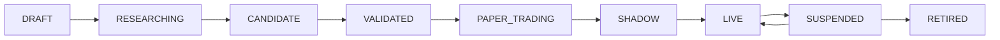

# IgniteQuant 产品需求文档（PRD）

> **产品名称**：IgniteQuant  
> **产品定位**：面向个人量化研究者的策略全生命周期管理与交易运营系统  
> **目标用户**：单人量化研究者、策略开发者、模拟及实盘操作者  
> **当前技术基础**：Python、tqsdk、FastAPI、React/Vite、Streamlit、Parquet/JSON  
> **文档版本**：v1.0  
> **文档日期**：2026-07-18  
> **默认环境**：回测、模拟盘；未经明确授权不得连接真实账户或发送真实委托

---

## 1. 文档目的

本文用于指导 Cursor Agents、Codex Agents 和人工开发者搭建 IgniteQuant 网页产品及其后端服务。

本文明确：

- 产品目标与边界；
- 用户角色和核心场景；
- 页面信息架构；
- 各页面功能、组件、状态与交互；
- 策略生命周期和业务流程；
- 核心数据实体与API契约；
- 实时数据和安全控制要求；
- 分阶段开发路线与验收标准。

本文不替代：

- `AGENTS.md` 中的代码架构和交易决策约束；
- Falcon策略说明书；
- 数据库详细DDL；
- 实盘交易和账户接入审批流程。

当PRD与交易安全约束冲突时，以 `AGENTS.md` 和 RiskEngine 的安全规则为最高优先级。

---

## 2. 产品愿景

IgniteQuant不应只是“回测网页”或“实盘看板”，而应成为：

> 一套帮助个人量化交易者管理策略全生命周期、控制模型风险、缩小回测与实盘差距的量化操作系统。

产品需要回答六个核心问题：

1. 哪个策略值得继续研究？
2. 哪个版本更稳定，而不仅是历史收益更高？
3. 策略是否具备进入模拟盘或实盘的条件？
4. 当前为什么持有这个仓位？
5. 回测、模拟和实盘为什么产生差异？
6. 策略何时应该降仓、暂停或退役？

---

## 3. 产品目标与非目标

### 3.1 产品目标

1. 建立统一策略、版本、实验、回测、部署和交易记录；
2. 实现可比较、可复现的回测实验；
3. 实现模拟盘和未来实盘的统一运营看板；
4. 展示完整决策链：Factor → Signal → Target → Risk → Order → Fill；
5. 建立策略健康、数据健康和系统健康监控；
6. 支持风险情景试算、风险告警和人工干预；
7. 支持策略晋级、降级、暂停和退役；
8. 为未来多策略资金配置和AI研究助手预留接口。

### 3.2 非目标

MVP不负责：

- 对外提供跟单、喊单或自动托管服务；
- 高频或超低延迟交易；
- 多组织、多租户和复杂权限系统；
- 自动修改生产策略参数；
- AI绕过RiskEngine直接下单；
- 自动认定某策略“必然盈利”；
- 建设微服务、Kafka或Kubernetes集群；
- 取代交易柜台、交易所和天勤账户事实。

---

## 4. 用户与核心场景

### 4.1 MVP用户角色

MVP只有一个真实用户角色：系统所有者。

系统内部仍应预留角色语义：

| 角色 | 主要能力 |
| --- | --- |
| Researcher | 创建策略、实验、回测和研究结论 |
| Operator | 启停模拟部署、处理告警、查看订单和成交 |
| Risk Owner | 设置风险阈值、执行暂停和Kill Switch |
| Viewer | 只读查看策略、回测和运行状态 |

MVP可以由同一用户拥有全部角色，但所有高风险操作仍必须审计。

### 4.2 核心使用场景

1. 创建一个Falcon新版本并提交回测；
2. 在相同数据和成本模型下比较多个版本；
3. 判断候选策略是否满足模拟盘晋级门槛；
4. 观察模拟盘当前信号、目标仓位和实际仓位；
5. 解释某笔交易为什么发生；
6. 识别回测与模拟盘表现偏差；
7. 发现策略因子或信号分布漂移；
8. 数据异常时禁止开仓并处理告警；
9. 对账户和持仓执行风险情景试算；
10. 暂停策略、禁止新开或触发紧急处置。

---

## 5. 产品北极星与衡量指标

### 5.1 北极星

> 每一次策略从想法到运行，都能够被复现、比较、解释、监控和安全回滚。

### 5.2 产品指标

| 指标 | 定义 |
| --- | --- |
| Experiment Reproducibility | 可通过代码、数据、配置和成本模型复现的实验占比 |
| Promotion Precision | 晋级模拟/实盘后没有迅速失效的策略占比 |
| Backtest-Live Parity | 回测、模拟、实盘信号和仓位的一致程度 |
| Decision Traceability | 能完整追溯到Factor/Signal/Target/Risk的成交占比 |
| Mean Time to Diagnose | 从告警发生到定位原因的平均时间 |
| Risk Containment Rate | 异常发生后没有继续扩大风险的事件占比 |
| Strategy Health Coverage | 有完整健康指标的运行策略占比 |

MVP产品指标不以累计收益作为唯一成功标准。

---

## 6. 策略生命周期



### 6.1 状态定义

| 状态 | 含义 | 允许行为 |
| --- | --- | --- |
| DRAFT | 策略或版本草稿 | 编辑说明和参数，不运行 |
| RESEARCHING | 正在进行实验 | 运行回测和稳健性测试 |
| CANDIDATE | 进入候选池 | 参与统一评分和比较 |
| VALIDATED | 通过样本外和压力门禁 | 可申请模拟盘 |
| PAPER_TRADING | 模拟盘运行 | 产生模拟订单和成交 |
| SHADOW | 使用实时数据，只记录不下单 | 对比理论与真实可成交结果 |
| LIVE | 真实账户运行 | 必须经过人工确认和审计 |
| SUSPENDED | 暂停新增风险 | 可观察、减仓或恢复 |
| RETIRED | 退役 | 只读保留全部历史 |

### 6.2 状态晋级门禁

晋级门禁必须由后端计算，前端不得直接改变状态。

最低门禁：

- 数据和配置版本完整；
- 回测成功且可复现；
- 样本外测试完成；
- 交易次数达到可配置最低值；
- 成本后期望收益为正；
- 最大回撤没有突破策略政策；
- 压力测试没有硬失败；
- 没有未解决的数据质量问题；
- 模拟/实盘前RiskEngine配置完整；
- 人工确认已记录。

阈值必须配置化，不在页面中硬编码。

---

## 7. 产品信息架构

### 7.1 一级导航

```text
Command Center
Strategy Lab
Backtest Compare
Portfolio Lab
Trading Cockpit
Risk Center
Health & Incidents
Settings
```

### 7.2 页面路由

| 页面 | 路由 |
| --- | --- |
| Command Center | `/` |
| 策略列表 | `/strategies` |
| 策略详情 | `/strategies/:strategyId` |
| 策略版本 | `/strategies/:strategyId/versions/:versionId` |
| 实验列表 | `/experiments` |
| 实验详情 | `/experiments/:experimentId` |
| 回测比较 | `/backtests/compare` |
| 组合实验室 | `/portfolio` |
| 模拟/实盘驾驶舱 | `/trading` |
| 部署详情 | `/trading/deployments/:deploymentId` |
| 风险中心 | `/risk` |
| 情景试算 | `/risk/scenarios` |
| 健康中心 | `/health` |
| 事故详情 | `/incidents/:incidentId` |
| 设置 | `/settings` |

### 7.3 全局页面布局

所有页面包含：

- 左侧一级导航；
- 顶部环境选择：Backtest / Paper / Shadow / Live；
- 顶部账户与策略范围选择；
- 全局时间范围；
- 系统状态灯；
- 最新严重告警入口；
- 当前代码、配置和数据版本入口。

Live环境必须使用高辨识度颜色和文本，不得只通过一个小图标区分。

---

## 8. 页面一：Command Center

### 8.1 页面目标

让用户在30秒内回答：

- 系统是否安全？
- 当前赚亏多少？
- 哪些策略正在运行？
- 有没有目标与实际仓位不一致？
- 当前最重要的风险或故障是什么？

### 8.2 页面模块

#### A. 全局状态条

展示：

- 环境；
- 行情连接；
- 交易连接；
- 数据库；
- 最近成功对账时间；
- 未知订单数；
- 当前运行状态：RUNNING / DEGRADED / HALTED。

#### B. 账户总览卡

展示：

- 总权益；
- 今日已实现/未实现盈亏；
- 可用资金；
- 保证金和保证金率；
- 日内最大回撤；
- 总开放风险。

#### C. 策略运行卡

每个部署展示：

- 策略名称和版本；
- 生命周期状态；
- 当前健康等级；
- 今日盈亏；
- 当前信号；
- 目标/批准/实际仓位；
- 最近决策时间；
- 是否允许新开仓。

#### D. 权益与回撤

- 权益曲线；
- 回撤曲线；
- 可切换账户、策略和组合；
- 标注风险事件、暂停和恢复时间。

#### E. 风险和事故

按严重度展示最近事件：

```text
CRITICAL / HIGH / MEDIUM / INFO
```

点击进入Risk Center或Incident详情。

#### F. 快捷操作

- 禁止新增仓位；
- 恢复新增仓位；
- 暂停部署；
- 发起对账；
- 打开Trading Cockpit；
- 打开Risk Center。

“全部平仓”不作为普通快捷按钮；必须进入风险处置流程并二次确认。

### 8.3 页面状态

- Loading：骨架屏；
- Empty：没有部署时引导创建模拟部署；
- Stale：数据超过阈值时卡片变黄并显示数据时间；
- Degraded：禁止新增风险，页面固定显示原因；
- Halted：红色全局横幅，不允许隐藏；
- Partial：部分服务不可用时仍展示最近可靠快照。

### 8.4 验收标准

- 用户可在首页看到环境、账户、风险和部署状态；
- 目标、批准和实际仓位同时展示；
- 数据过期时明确标识，不能继续显示为正常；
- HALTED状态全局可见；
- 所有快捷操作生成审计记录；
- Live操作需要后端权限和确认，不得由前端直接调用tqsdk。

---

## 9. 页面二：Strategy Lab

### 9.1 页面目标

管理策略、版本、参数、实验、研究结论和晋级状态。

### 9.2 策略列表

字段：

- 策略名称；
- 当前推荐版本；
- 生命周期状态；
- 最近回测；
- 样本外收益；
- 最大回撤；
- 稳健性分；
- 过拟合风险；
- 当前部署环境；
- 健康状态。

筛选：

- 状态；
- 品种；
- 周期；
- 策略类型；
- 是否部署；
- 健康等级。

### 9.3 策略详情

Tab：

```text
Overview
Versions
Factors
Experiments
Deployments
Decisions
Notes
```

#### Overview

- 策略假设；
- 适用行情；
- 不适用行情；
- 交易品种和周期；
- 当前生产版本；
- 最新晋级结论；
- 关键风险。

#### Versions

每个版本展示：

- 版本号；
- Git commit；
- 参数哈希；
- 创建时间；
- 与上一版本差异；
- 实验数量；
- 当前生命周期状态。

版本上线后不可原地修改，只能创建新版本。

#### Factors

- 因子定义；
- 当前权重；
- 因子覆盖率；
- 因子分布；
- 因子相关性；
- 条件收益；
- 因子漂移；
- 版本变化。

#### Experiments

- 回测、Walk-forward、压力测试；
- 状态、时间、数据和成本模型；
- 结果摘要；
- 研究结论和标签。

### 9.4 创建实验

表单字段：

- 策略版本；
- 品种；
- K线周期；
- 开始/结束时间；
- 训练、验证、测试划分；
- 初始资金；
- 手续费模型；
- 滑点模型；
- 主力换月规则；
- 参数覆盖；
- 随机种子；
- 实验标签和备注。

提交后返回异步任务，不得阻塞HTTP请求。

### 9.5 候选晋级面板

展示硬门禁和评分：

| 维度 | 建议权重 |
| --- | ---: |
| 样本外收益 | 20 |
| 回撤与尾部风险 | 20 |
| 跨周期稳定性 | 20 |
| 参数稳健性 | 15 |
| 成本后表现 | 15 |
| 样本量与可交易性 | 10 |

评分只在硬门禁全部通过后计算。用户必须能查看每项分数来源，禁止只显示一个总分。

### 9.6 验收标准

- 策略、版本和实验相互独立；
- 已使用版本不可原地修改；
- 实验保存代码、数据、配置和成本模型版本；
- 晋级状态由后端门禁决定；
- 用户能看到评分来源和失败原因；
- 实验任务可取消、失败重试并保留错误摘要。

---

## 10. 页面三：Backtest Compare

### 10.1 页面目标

在统一口径下比较多个策略版本或实验，避免“不同数据和成本假设下的伪比较”。

### 10.2 比较前门禁

系统必须检查：

- 数据版本；
- 回测区间；
- 初始资金；
- 手续费；
- 滑点；
- 换月规则；
- K线周期；
- 成交模型；
- 期末处置规则。

如果不一致，页面显示差异并要求：

1. 重新按统一口径回测；或
2. 明确选择“带差异比较”，结果标记为不可直接排名。

### 10.3 页面模块

#### A. 对比选择器

- 选择2—6个实验；
- 保存对比集合；
- 选择基准版本；
- 锁定比较口径。

#### B. 核心指标表

- 总收益、年化收益；
- 最大回撤；
- Sharpe、Sortino、Calmar；
- 胜率、盈亏比、期望值；
- 交易次数、换手率；
- 手续费、滑点、换月损益；
- 最大连续盈利/亏损；
- MFE / MAE；
- 样本外指标。

#### C. 净值与回撤图

- 统一基准归一化；
- 可切换全样本/训练/验证/测试；
- 同时展示回撤；
- 标注最大回撤区间。

#### D. 行情状态归因

按以下维度拆分：

- TREND_UP；
- TREND_DOWN；
- RANGE；
- TRANSITION；
- 高/中/低波动；
- 日盘/夜盘；
- 多头/空头。

#### E. 稳健性面板

- 参数热力图；
- Walk-forward结果；
- 手续费倍数压力；
- 滑点倍数压力；
- 信号延迟压力；
- Bootstrap置信区间；
- 样本外退化比例。

#### F. 交易明细

支持筛选：

- 盈利/亏损；
- 多头/空头；
- 行情状态；
- 止损/止盈/信号退出；
- 高滑点；
- 特定日期区间。

点击交易进入决策链详情。

### 10.4 验收标准

- 不同口径实验不能静默排名；
- 所有图表和表格使用同一过滤范围；
- 可以查看样本内和样本外差异；
- 参数单点最优被标记为过拟合风险；
- 任一交易可进入Factor/Signal/Target/Risk详情；
- 对比结果可保存并重新打开。

---

## 11. 页面四：Portfolio Lab

### 11.1 页面目标

从“选择最好策略”升级为“配置风险更合理的策略组合”。

MVP可先做只读分析和模拟组合，不直接控制实盘资金。

### 11.2 页面模块

- 策略选择；
- 权重输入；
- 等资金、等风险、波动率倒数等模板；
- 相关性矩阵；
- 风险贡献；
- 保证金占用；
- 多空和品种敞口；
- 组合净值和回撤；
- 历史压力测试；
- 组合与单策略对比。

### 11.3 风险贡献

页面必须同时展示：

- 资金权重；
- 波动贡献；
- 回撤贡献；
- 保证金贡献；
- 当前开放风险贡献。

不能让用户误以为资金权重等于风险权重。

### 11.4 约束

可配置：

- 单策略最大权重；
- 单品种最大风险；
- 贵金属等相关板块上限；
- 总保证金上限；
- 最低现金缓冲；
- 总开放风险上限。

### 11.5 验收标准

- 组合计算结果可复现；
- 资金和风险贡献分开显示；
- 权重违反约束时不能保存为候选组合；
- MVP组合只用于分析，不自动修改运行仓位；
- 保存组合必须记录输入策略版本和数据版本。

---

## 12. 页面五：Trading Cockpit

### 12.1 页面目标

统一查看模拟、影子和未来实盘的策略决策、风险、订单、成交和持仓。

### 12.2 页面头部

展示：

- 环境；
- 账户；
- 策略和版本；
- 部署ID；
- 运行状态；
- 当前合约和连续合约；
- 代码、配置、数据版本；
- 最后行情、决策和对账时间。

### 12.3 决策链卡片

同屏展示：

```text
Factor
→ Signal
→ Requested Target
→ Risk Approved Target
→ Actual Position
```

示例：

```text
Alpha：0.72，多头，确认2根
策略目标：3手
风险批准：2手（保证金限制）
实际仓位：1手
未成交差额：1手
```

每一步可展开查看原因和版本。

### 12.4 行情与信号图

- K线；
- MA7/14/52；
- 止损、止盈、入场均价；
- 信号点；
- 目标和实际成交点；
- 主力换月标记；
- 数据异常标记。

### 12.5 委托与成交

委托表：

- 本地订单号；
- 柜台订单号；
- 决策ID；
- 买卖、开平；
- 价格、数量；
- 已成和未成；
- 状态；
- 委托、确认和更新时间；
- 拒单信息。

成交表：

- 成交号；
- 对应订单；
- 成交价量；
- 手续费；
- 理论价；
- 滑点；
- 成交时间。

### 12.6 仓位与风险

- 多今、多昨、空今、空昨；
- 净仓；
- 平均入场价；
- 实际止损；
- 当前未实现盈亏；
- 每手和总开放风险；
- 保证金占用。

### 12.7 操作

MVP允许：

- 暂停新增仓位；
- 恢复新增仓位；
- 暂停策略；
- 发起对账；
- 取消本策略未成委托；
- 进入风险处置流程。

高风险操作必须：

- 由后端生成操作预览；
- 显示预计影响；
- 用户确认；
- 使用幂等键；
- 写审计日志；
- 返回实际执行结果。

前端不得直接连接天勤或拼装交易委托。

### 12.8 验收标准

- 用户可看到目标、批准、实际仓位差；
- 部分成交不会显示为完全成交；
- 订单UNKNOWN时显示红色并禁止重复下单；
- 每笔成交可以回溯到决策；
- Live和Paper视觉明确区分；
- 高风险操作必须经过预览、确认和审计。

---

## 13. 页面六：Risk Center

### 13.1 页面目标

集中展示事前、账户、组合和运行风险，并提供安全的风险处置入口。

### 13.2 风险总览

- 当前RiskEngine状态；
- 今日风险事件数量；
- 单日亏损和阈值；
- 当前回撤和阈值；
- 保证金率和阈值；
- 总开放风险；
- 未知订单；
- 对账状态；
- 禁止新开状态；
- Kill Switch状态。

### 13.3 风控审批流

列表展示：

- 时间；
- 策略、版本、账户；
- 请求目标；
- 批准目标；
- PASS / RESIZE / REJECT / HALT；
- 命中的规则；
- 风险快照；
- 后续订单结果。

### 13.4 情景试算

支持：

#### 市场情景

- 价格±1%、±2%、±3%；
- 波动率扩大；
- 跳空；
- 涨跌停；
- 无法平仓。

#### 账户情景

- 保证金率上调；
- 所有挂单成交；
- 多策略同时触发；
- 连续止损。

#### 系统情景

- 行情中断；
- 订单UNKNOWN；
- 数据库不可用；
- 程序重启；
- 主力换月失败。

输出：

- 预计盈亏；
- 保证金率；
- 最大风险；
- 命中规则；
- 系统建议动作；
- 是否需要人工确认。

### 13.5 Kill Switch

分为：

1. `PAUSE_NEW_RISK`：立即禁止新增风险；
2. `CANCEL_PENDING`：撤销本策略可撤委托；
3. `REDUCE_RISK`：按预案减仓；
4. `EMERGENCY_FLAT`：紧急平仓请求。

`PAUSE_NEW_RISK`应当快速可达；`EMERGENCY_FLAT`必须展示市场状态、预计订单和可能无法成交风险，并进行强化确认。

### 13.6 验收标准

- 风控事件可按规则、策略和时间筛选；
- RESIZE能显示从请求到批准的变化；
- 情景试算不修改真实账户；
- Kill Switch状态全局同步；
- 风险减少订单不会被普通开仓规则阻止；
- 所有人工覆盖和恢复均写审计日志。

---

## 14. 页面七：Health & Incidents

### 14.1 页面目标

区分策略失效、数据异常、执行问题和系统故障，降低诊断时间。

### 14.2 健康维度

#### 策略健康

- 实盘/模拟收益相对回测偏离；
- 胜率、盈亏比、交易频率漂移；
- 因子分布漂移；
- 信号分布漂移；
- 回撤状态；
- 行情适配度。

#### 数据健康

- K线延迟；
- 缺失、重复、倒序；
- 主连映射；
- 合约规则完整性；
- 指标NaN和异常值。

#### 执行健康

- 下单确认延迟；
- 拒单率；
- 撤单率；
- 部分成交率；
- 实际滑点；
- 目标与实际仓位差。

#### 系统健康

- 行情/交易连接；
- 数据库；
- Worker；
- 事件循环延迟；
- 最后心跳；
- 对账状态。

### 14.3 策略健康分

建议权重：

| 维度 | 权重 |
| --- | ---: |
| 表现偏离 | 25 |
| 因子与信号漂移 | 20 |
| 回撤状态 | 20 |
| 执行质量 | 15 |
| 数据和系统质量 | 10 |
| 当前行情适配 | 10 |

状态：

```text
HEALTHY
WATCH
DEGRADED
CRITICAL
```

必须同时展示原始指标，不能只显示总分。

### 14.4 Incident流程

```text
OPEN
→ ACKNOWLEDGED
→ MITIGATING
→ RESOLVED
→ REVIEWED
```

Incident记录：

- 发生时间；
- 严重度；
- 影响账户、策略和订单；
- 触发指标；
- 自动动作；
- 人工动作；
- 恢复时间；
- 根因；
- 改进任务。

### 14.5 验收标准

- 四类健康状态分开显示；
- CRITICAL事件自动创建Incident；
- Incident状态变化有时间线和操作者；
- 策略健康分可以追溯到原始指标；
- 用户能区分策略亏损与系统异常；
- 已解决事故保留复盘和改进任务。

---

## 15. 页面八：Settings

### 15.1 配置分类

- 数据源；
- 回测默认参数；
- 手续费和滑点模型；
- 策略晋级政策；
- 风险阈值；
- 健康和告警阈值；
- 通知；
- 环境和账户；
- 用户界面偏好。

### 15.2 配置版本

每次配置修改必须生成：

- 新版本；
- 修改前后差异；
- 修改人；
- 修改原因；
- 生效环境；
- 生效时间；
- 回滚入口。

密钥只显示是否配置，不能回显实际值。

### 15.3 验收标准

- 风险和策略参数不能无版本覆盖；
- Live配置修改需要强化确认；
- 密钥不返回前端；
- 可以查看历史版本和差异；
- 配置回滚产生新的版本和审计事件。

---

## 16. 决策链详情页/抽屉

任意信号、仓位、订单、成交和风险事件都可以打开统一详情组件。

### 16.1 展示结构

```text
Market Bar
  ↓
FactorSnapshot
  ↓
SignalEvent
  ↓
TargetPosition
  ↓
RiskDecision
  ↓
OrderIntent / BrokerOrder
  ↓
TradeFill
  ↓
PnL Attribution
```

### 16.2 每层信息

- ID和关联ID；
- 时间和可获得时间；
- 输入摘要；
- 输出；
- 原因码；
- 代码/模型/配置版本；
- 是否发生人工覆盖；
- 是否存在数据质量问题。

### 16.3 验收标准

- 任一成交可完整回溯；
- 任一REJECT/RESIZE可看到命中规则；
- HOLD和FLAT明确区分；
- 关联记录缺失时显示“链路不完整”告警，不能静默隐藏。

---

## 17. 回测—模拟—实盘一致性

### 17.1 一致性维度

- Factor一致性；
- Signal一致性；
- Target一致性；
- Risk Decision一致性；
- 订单与成交差异；
- 滑点差异；
- PnL差异。

### 17.2 一致性页面组件

| 项目 | 回测 | 模拟 | 实盘 |
| --- | --- | --- | --- |
| 信号时间 | 10:35 | 10:35 | 10:35 |
| Alpha | 0.72 | 0.72 | 0.71 |
| 策略目标 | 3 | 3 | 3 |
| 风控批准 | 2 | 2 | 1 |
| 实际成交 | 2 | 2 | 1 |
| 滑点 | 1 Tick | 2 Tick | 4 Tick |

### 17.3 偏差原因

系统至少识别：

- 代码或配置版本不同；
- 数据延迟或缺失；
- 主连映射不同；
- 模拟成交假设与真实成交不同；
- 部分成交；
- 风控快照不同；
- 手续费和滑点不同；
- 信号处理时间不同。

### 17.4 验收标准

- 用户能按bar查看三环境差异；
- 版本不一致时首先提示；
- 差异有可枚举原因；
- 无法解释的差异自动进入健康告警。

---

## 18. AI研究助手（P2）

### 18.1 允许能力

- 总结回测；
- 比较策略；
- 分析最大回撤；
- 解释近期连续止损；
- 总结因子和信号漂移；
- 生成研究假设；
- 生成周报和Incident复盘草稿；
- 把自然语言转换为回测任务草稿。

### 18.2 禁止能力

- 直接修改生产参数；
- 自动晋级策略；
- 自动恢复HALTED策略；
- 绕过RiskEngine；
- 直接下单；
- 删除审计记录；
- 把生成内容冒充确定事实。

### 18.3 产品要求

- AI回答必须引用系统内数据和时间范围；
- 明确区分事实、推断和建议；
- AI生成的实验必须由用户确认后提交；
- 所有AI操作记录输入、输出、模型和时间；
- AI服务异常不得影响交易热路径。

---

## 19. 核心数据实体

| 实体 | 作用 | 关键关系 |
| --- | --- | --- |
| Strategy | 策略身份 | 一对多StrategyVersion |
| StrategyVersion | 不可变代码和参数版本 | 一对多Experiment、Deployment |
| DatasetVersion | 数据版本 | 被Experiment引用 |
| CostModel | 手续费和滑点 | 被Experiment引用 |
| Experiment | 研究任务 | 产生BacktestRun |
| BacktestRun | 单次回测事实 | 产生Metric、Trade、Equity |
| ComparisonSet | 保存的比较集合 | 引用多个BacktestRun |
| PromotionReview | 晋级门禁与人工结论 | 关联StrategyVersion |
| PortfolioDefinition | 策略组合 | 引用多个StrategyVersion |
| Deployment | Paper/Shadow/Live部署 | 关联策略版本和账户 |
| FactorSnapshot | 因子快照 | 产生SignalEvent |
| SignalEvent | 信号 | 产生TargetPosition |
| TargetPosition | 策略目标 | 产生RiskDecision |
| RiskDecision | 风控审批 | 产生OrderIntent |
| OrderIntent | 订单意图 | 关联BrokerOrder |
| BrokerOrderEvent | 委托事件 | 关联TradeFill |
| TradeFill | 成交事实 | 更新PositionSnapshot |
| PositionSnapshot | 持仓快照 | 关联Deployment和Account |
| AccountSnapshot | 账户快照 | 用于风险和看板 |
| HealthSnapshot | 健康状态 | 可触发Alert/Incident |
| Alert | 告警 | 可升级为Incident |
| Incident | 事故和复盘 | 关联审计和改进任务 |
| AuditEvent | 高风险操作审计 | 关联用户和对象 |

所有交易链实体必须包含稳定ID、时间、版本和关联ID。

---

## 20. API需求

API统一使用 `/api/v1`。响应必须包含明确schema版本和服务器时间。

### 20.1 Command Center

```text
GET /api/v1/overview
GET /api/v1/accounts/:accountId/summary
GET /api/v1/deployments/summary
GET /api/v1/alerts?status=open
```

### 20.2 Strategy Lab

```text
GET  /api/v1/strategies
POST /api/v1/strategies
GET  /api/v1/strategies/:strategyId
POST /api/v1/strategies/:strategyId/versions
GET  /api/v1/strategies/:strategyId/versions/:versionId
POST /api/v1/strategy-versions/:versionId/promotion-reviews
```

### 20.3 实验与回测

```text
GET    /api/v1/experiments
POST   /api/v1/experiments
GET    /api/v1/experiments/:experimentId
POST   /api/v1/experiments/:experimentId/cancel
POST   /api/v1/experiments/:experimentId/retry
GET    /api/v1/backtest-runs/:runId
POST   /api/v1/backtest-comparisons
GET    /api/v1/backtest-comparisons/:comparisonId
DELETE /api/v1/backtest-comparisons/:comparisonId
```

### 20.4 部署与交易

```text
GET  /api/v1/deployments
POST /api/v1/deployments
GET  /api/v1/deployments/:deploymentId
GET  /api/v1/deployments/:deploymentId/decisions
GET  /api/v1/deployments/:deploymentId/orders
GET  /api/v1/deployments/:deploymentId/fills
POST /api/v1/deployments/:deploymentId/actions/preview
POST /api/v1/deployments/:deploymentId/actions/execute
```

高风险动作必须采用Preview → Execute两阶段，并携带：

- `action_type`；
- `idempotency_key`；
- `preview_id`；
- `expected_state_version`；
- `confirmation_text`；
- `reason`。

### 20.5 风险与情景

```text
GET  /api/v1/risk/summary
GET  /api/v1/risk/decisions
POST /api/v1/risk/scenarios
GET  /api/v1/risk/scenarios/:scenarioId
POST /api/v1/risk/actions/preview
POST /api/v1/risk/actions/execute
```

### 20.6 健康与事故

```text
GET   /api/v1/health/summary
GET   /api/v1/health/strategies/:strategyId
GET   /api/v1/incidents
POST  /api/v1/incidents
GET   /api/v1/incidents/:incidentId
PATCH /api/v1/incidents/:incidentId
POST  /api/v1/incidents/:incidentId/review
```

### 20.7 审计与配置

```text
GET  /api/v1/audit-events
GET  /api/v1/config/versions
POST /api/v1/config/versions
POST /api/v1/config/versions/:versionId/activate
```

### 20.8 错误格式

```json
{
  "error": {
    "code": "RECONCILIATION_MISMATCH",
    "message": "账户持仓与本地持仓不一致，已禁止新增风险",
    "retryable": false,
    "correlation_id": "...",
    "details": {}
  },
  "server_time": "2026-07-18T12:00:00Z",
  "schema_version": "1"
}
```

前端根据 `code` 处理，不解析自然语言决定业务逻辑。

---

## 21. 实时更新

### 21.1 推荐方式

- REST用于查询、创建任务和高风险操作；
- WebSocket或SSE用于账户、部署、决策、订单、成交、告警和健康事件；
- 前端断线后先重新拉取快照，再恢复事件流；
- 每个事件包含递增序列或版本，避免乱序覆盖。

### 21.2 更新频率

| 数据 | 目标频率 |
| --- | --- |
| 连接和心跳 | 1秒或事件触发 |
| 账户、持仓和风险 | 1—2秒或事件触发 |
| 订单和成交 | 事件触发 |
| K线和策略决策 | 新完整K线触发 |
| 权益曲线 | 5秒或事件触发 |
| 策略健康 | 1—5分钟 |
| 数据质量 | 事件触发 |

5分钟策略不要求毫秒级刷新，但订单、成交和风险状态必须及时显示。

### 21.3 断线状态

前端必须区分：

- `CONNECTED`；
- `RECONNECTING`；
- `STALE`；
- `DISCONNECTED`。

断线时不能继续显示“实时”标签。

---

## 22. 技术实现建议

### 22.1 前端

- 复用现有React/Vite项目和设计系统；
- 路由按本文信息架构拆分；
- 数据请求统一封装；
- 服务器状态使用现有成熟方案或项目当前方案；
- 图表组件支持时间联动和统一筛选；
- 高风险按钮使用统一组件；
- 禁止页面直接拼装交易请求。

### 22.2 后端

- FastAPI作为HTTP和事件网关；
- 应用服务调用领域层和Repository；
- 长回测使用本地Worker/进程队列，MVP不必上外部消息系统；
- 回测和交易热路径与Web请求线程隔离；
- 高风险操作使用Application Service和审计；
- API不得直接导入策略内部实现细节。

### 22.3 存储

- 行情和研究结果：Parquet；
- 本地开发和任务元数据：SQLite WAL；
- 真实订单、成交、审计和状态：实盘前迁移PostgreSQL；
- JSON/Excel只作为导出，不是唯一事实源。

### 22.4 不得破坏的架构边界

- 网页层不进入交易热路径；
- AI不进入交易热路径；
- 回测、模拟和实盘共用决策核；
- 前端不连接tqsdk；
- RiskEngine拥有新增风险否决权；
- 实际仓位以柜台和对账事实为准；
- 目标仓位不等于实际仓位。

---

## 23. 非功能需求

### 23.1 正确性

- 金额、仓位、订单和成交不能因前端刷新丢失；
- 所有时间明确时区；
- 交易日和自然日分开；
- 关键数字显示数据时间和来源；
- 同一版本和输入的实验可复现。

### 23.2 性能

- 普通列表和详情P95响应小于1秒；
- Command Center快照P95小于2秒；
- 订单和成交事件在后端收到后2秒内展示；
- 长回测不阻塞API；
- 10万级交易明细使用分页或虚拟列表。

### 23.3 可用性

- 局部服务失败时页面展示最近可靠快照；
- 数据过期必须显式标记；
- 前端重连后进行快照校准；
- 操作失败不得显示假成功。

### 23.4 安全

- 密钥不返回前端；
- 日志不记录密码和完整账户凭证；
- 高风险操作服务端鉴权；
- 操作使用幂等键；
- Live环境显式标识；
- 所有人工干预可审计。

### 23.5 可观测性

每个请求和事件包含 `correlation_id`。关键指标：

- API延迟和错误率；
- Worker队列和运行状态；
- 实时连接数和重连；
- 行情及交易事件延迟；
- 目标与实际仓位差；
- 未知订单和对账失败；
- 高风险操作结果。

---

## 24. 通用交互规范

### 24.1 状态颜色

| 状态 | 颜色语义 |
| --- | --- |
| 正常/通过 | 绿色 |
| 观察/数据过期 | 黄色 |
| 降级/拒绝 | 橙色 |
| HALTED/严重风险 | 红色 |
| 未运行/未知 | 灰色 |

不能只用颜色表达，必须同时有文本和图标。

### 24.2 数值规范

- 金额显示币种；
- 百分比保留统一位数；
- 仓位显示多今、多昨、空今、空昨和净仓；
- 盈亏标明已实现/未实现；
- 风险指标显示当前值、阈值和剩余空间；
- 所有实时值显示最后更新时间。

### 24.3 空状态

空状态必须告诉用户：

- 为什么没有数据；
- 需要执行什么操作；
- 是否因为筛选条件；
- 是否因为系统异常。

### 24.4 高风险确认

确认弹窗必须展示：

- 环境和账户；
- 操作对象；
- 当前状态；
- 预计影响；
- 不能保证成交的风险；
- 操作原因输入；
- 确认文本。

---

## 25. MVP范围与优先级

### P0：建立可信度

必须交付：

1. 全局应用框架和导航；
2. Command Center；
3. Strategy Lab基础版；
4. 异步回测任务；
5. Backtest Compare基础版；
6. Trading Cockpit模拟盘版；
7. 决策链详情；
8. Risk Center基础版；
9. 数据与系统健康；
10. 审计和配置版本。

### P1：提升决策能力

1. Walk-forward和稳健性实验室；
2. 策略健康分；
3. 盈亏归因；
4. 回测—模拟—实盘一致性；
5. 情景试算；
6. Incident流程；
7. 策略晋级和退役机制。

### P2：形成系统能力

1. Portfolio Lab完整能力；
2. 动态资金配置研究；
3. AI研究助手；
4. 自动周报和复盘；
5. 多账户和多品种扩展。

---

## 26. Agents实施路线

Agent不得一次性实现全部PRD。每个Epic独立开发、验证和交付。

### Epic 0：现状审计与契约

目标：确认现有前端、FastAPI、runner、store和数据对象。

交付：

- 当前路由和组件清单；
- 当前API和返回字段；
- 当前数据源；
- 产品实体到现有代码的映射；
- 缺失API清单；
- OpenAPI/Pydantic基础契约。

不得修改交易逻辑。

### Epic 1：应用框架

- 一级导航；
- 环境和范围选择；
- 全局状态和告警；
- 统一Loading/Empty/Error/Stale；
- API client和实时连接基础设施。

### Epic 2：Command Center

- Overview API；
- 账户和部署卡；
- 权益/回撤；
- 风险和健康摘要；
- 只读快捷入口。

高风险操作先使用Mock/Preview，不连接真实交易。

### Epic 3：Strategy Lab

- Strategy、Version、Experiment实体；
- 策略列表和详情；
- 版本不可变；
- 创建异步实验；
- 任务状态和错误。

### Epic 4：Backtest Compare

- 统一口径门禁；
- 指标和净值比较；
- 行情状态归因；
- 交易明细；
- 保存比较集合。

### Epic 5：Trading Cockpit

- Deployment详情；
- Factor/Signal/Target/Risk链；
- 订单、成交、仓位；
- 模拟盘实时事件；
- 对账和数据过期状态。

### Epic 6：Risk与Health

- 风控审批列表；
- 风险总览；
- 数据、系统、策略、执行健康；
- 告警和Incident；
- PAUSE_NEW_RISK的Preview/Execute流程。

### Epic 7：稳健性与一致性

- Walk-forward；
- 参数热力图；
- 成本压力；
- 回测/模拟/实盘差异；
- 策略健康分。

### Epic 8：Portfolio和AI

仅在前述能力稳定后实施。

---

## 27. Agents每个Epic的工作模板

修改前输出：

```markdown
## Epic理解
- 本次Epic：
- 用户价值：
- 范围：
- 非范围：
- 涉及页面：
- 涉及API：
- 涉及实体：

## 当前证据
- 现有组件：
- 现有API：
- 现有数据：
- PRD与源码冲突：

## 实施计划
1. ...
2. ...

## 验证计划
- 单元测试：
- API契约测试：
- 页面测试：
- 异常状态测试：
- 不触及交易热路径的证明：
```

完成后输出：

```markdown
## 完成内容
- ...

## 页面与交互
- ...

## API与数据
- ...

## 验证结果
- 命令：
- 通过项：
- 未运行项：

## 已知限制
- ...

## 下一Epic建议
- ...
```

---

## 28. 产品Definition of Done

单个页面完成标准：

- [ ] 页面满足对应目标和核心用户问题；
- [ ] Loading、Empty、Error、Stale、Partial状态齐全；
- [ ] 数据时间、环境和来源可见；
- [ ] API使用显式schema；
- [ ] 错误按错误码处理；
- [ ] 页面不直接访问数据库或tqsdk；
- [ ] 高风险操作经过后端Preview/Execute；
- [ ] 桌面主要分辨率可用；
- [ ] 关键交互有测试；
- [ ] 数据缺失不显示误导性正常状态；
- [ ] 相关操作写入审计；
- [ ] 文档和API同步。

MVP整体完成标准：

- [ ] 可以创建策略版本和异步回测实验；
- [ ] 可以统一口径比较策略；
- [ ] 可以查看模拟部署和完整决策链；
- [ ] 可以看到目标、批准和实际仓位差；
- [ ] 可以查看RiskEngine审批和原因码；
- [ ] 可以识别数据、系统和执行异常；
- [ ] 可以暂停新增风险并完成审计；
- [ ] 所有回测结果可复现；
- [ ] 任一成交可追溯；
- [ ] 网页和AI均不进入交易热路径；
- [ ] 默认不连接或操作真实账户。

---

## 29. 推荐给Agents的首个任务

```text
请阅读根目录AGENTS.md、本PRD、架构说明、Ruler.md，以及web/和dashboard/的现有代码。

本次只执行PRD Epic 0“现状审计与契约”，不要改策略逻辑、交易执行、风险参数或真实账户配置。

请完成：
1. 列出现有React页面、组件、路由和设计系统；
2. 列出现有FastAPI路由、Pydantic schema和数据来源；
3. 列出dashboard runner、JSON store和策略核心的调用边界；
4. 将PRD核心实体映射到现有对象，标记缺失项；
5. 给出P0页面和API的最小实施顺序；
6. 为现有API添加契约测试或快照测试建议；
7. 输出Epic 1的可执行计划，但不要开始编码Epic 1。

如果PRD与源码不一致，以源码和可重复测试为证据报告冲突，不得静默修改交易行为。
```

---

## 30. 变更记录

| 版本 | 日期 | 说明 |
| --- | --- | --- |
| v1.0 | 2026-07-18 | 初版：产品定位、信息架构、八大页面、数据实体、API、实时更新、MVP范围和Agents实施路线 |

