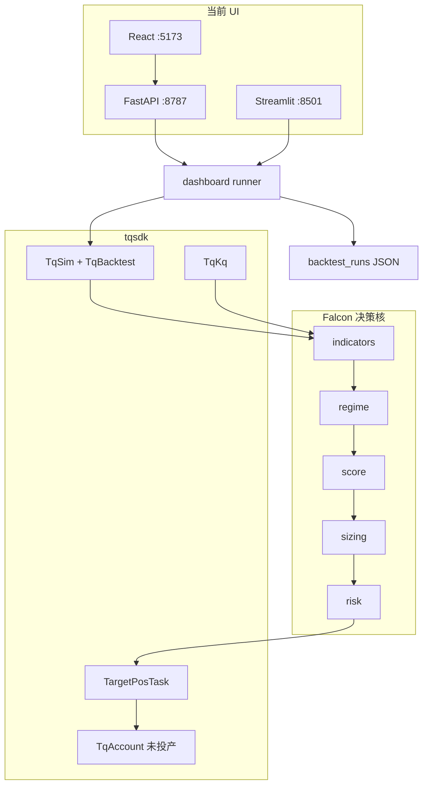
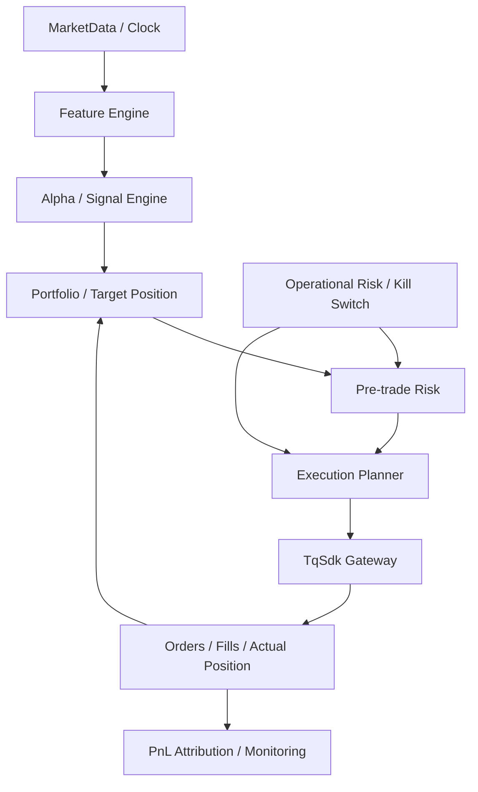
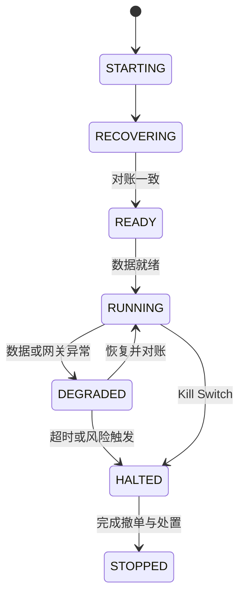
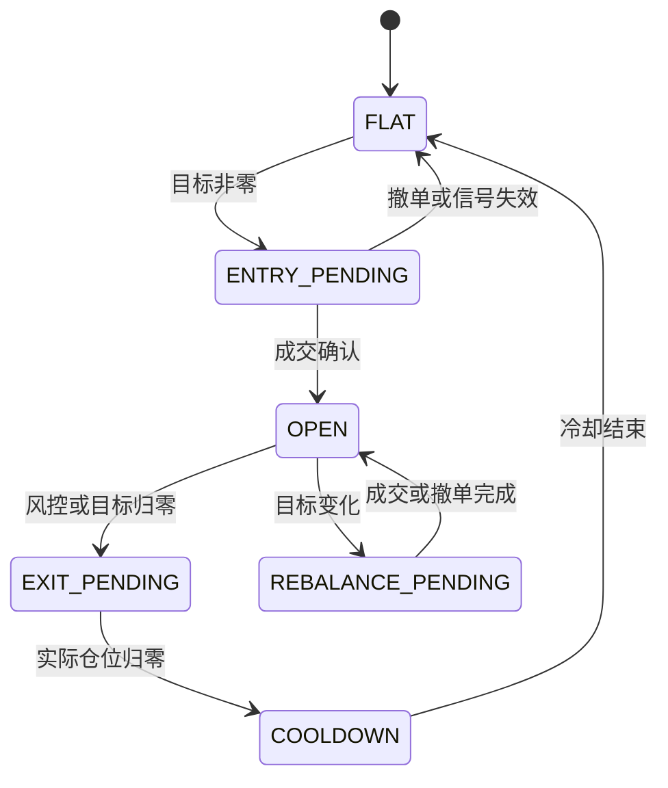

# IgniteQuant 工业级重构章程（供 Cursor Agents / 人工审阅）

> **文档性质**：本文件同时描述当前架构、目标架构、重构边界和验收门禁，是 Cursor Agents 执行重构时的最高级项目内约束。  
> **适用仓库**：<https://github.com/hawk1949-rs/IgniteQuant>  
> **当前定位**：单人维护、沪金优先、先回测与模拟、再小资金实盘的期货量化系统。  
> **目标定位**：保持单体部署和低运维成本，同时达到可复现、可审计、可恢复、可验证的工程标准。  
> **文档日期**：2026-07-17。  
> **策略说明**：Falcon v2 的经济逻辑见 `Falcon_v2_沪金策略说明.md`；开发与运维备忘见 `Ruler.md`。

---

## 0. Cursor Agents 使用规则

### 0.1 规范词

- **MUST / 必须**：违反即视为重构失败。
- **SHOULD / 应当**：除非有书面理由，否则必须执行。
- **MAY / 可以**：可按当前阶段和成本选择。

### 0.2 事实优先级

当本文、源码、测试、配置或 README 不一致时，按以下顺序确认事实：

1. 可重复运行的测试与真实柜台/回测行为；
2. 当前源码和显式配置；
3. 本文记录的当前状态；
4. 其他说明文档与注释。

发现冲突时，Agent **不得静默选择一种解释**。必须在变更说明中记录：冲突、采用的解释、证据和后续影响，并同步修正文档或测试。

### 0.3 重构总原则

1. **先冻结行为，再调整结构，最后研究参数。** 架构重构与策略优化不得在同一个阶段混做。
2. **因子不直接下单，信号不直接决定委托，风险层拥有否决权。**
3. **回测、模拟和实盘共用同一决策核。** 环境差异只能存在于数据源、时钟、账户和执行适配器。
4. **目标仓位与实际仓位分离。** 所有委托都必须能回溯到信号、目标仓位和风控决策。
5. **失败时禁止扩大风险。** 数据过期、仓位不一致、订单状态未知或系统降级时，只允许撤单、减仓和平仓。
6. **不为“看起来工业化”引入微服务、Kafka、Kubernetes 或复杂分布式事务。** 当前阶段优先建设清晰边界、持久化、测试和恢复能力。

### 0.4 Agent 开工前检查

每次结构性修改前，Agent MUST：

1. 阅读本文及涉及目录的源码；
2. 执行 `git status`，保留用户已有修改；
3. 找到现有启动命令、配置入口和测试命令，不得凭空假设；
4. 写出本次变更的范围、非范围、风险和验收方式；
5. 对现有行为建立 characterization test 或 golden master；
6. 小步修改并在每个阶段运行相关测试；
7. 未经明确授权，不提交密钥、不删除用户数据、不执行真实下单、不扩大实盘仓位。

---

## 1. 当前系统基线

### 1.1 一句话架构

```text
研究层（Agent Skills / LLMQuant MCP，不进入交易热路径）
        ↓
作坊层（React ↔ FastAPI / Streamlit） → JSON 回测档案
        ↓
tqsdk Runner（回测 / 模拟各自维护事件循环）
        ↓
Falcon 决策核（指标 → 行情状态 → 评分 → 手数 → 风控）
        ↓
TargetPosTask → 目标净仓
```

当前优势是 Falcon 决策核已初步模块化；主要风险是三套主循环复制、参数来源分散、订单与成交缺少完整审计链、风险状态与真实成交状态未充分分离。

### 1.2 当前目标与非目标

| 当前目标 | 当前非目标 |
| --- | --- |
| 可复现的 Falcon 信号和基础风控闭环 | 低延迟或高频交易系统 |
| 本地回测 → 快期模拟 → 银河实盘 | 多账户、多团队和多地域部署 |
| 单人可维护的策略对比、打分和笔记 | 机构级多租户 OMS / 风控中台 |
| 沪金优先，兼顾沪银、沪铜扩展 | 为尚不存在的规模提前微服务化 |
| 可选 Excel 和 Web 看板 | 自研行情源和全深度盘口系统 |

### 1.3 当前目录地图

| 路径 | 当前职责 | 是否交易热路径 |
| --- | --- | --- |
| `strategies/falcon/` | 指标、行情状态、评分、手数、风控 | 是，决策核 |
| `strategies/falcon_au_backtest.py` | `TqSim + TqBacktest` CLI 回测 | 是 |
| `strategies/falcon_au_sim.py` | `TqKq` 快期模拟 | 是 |
| `strategies/vwap_au_backtest.py` | 独立 VWAP 示例 | 旁路 |
| `dashboard/` | catalog、runner、scoring、store、Streamlit、FastAPI | 半热路径 |
| `web/` | Vite React 前端 | 否 |
| `common/backtest_archive.py` | Excel 存档 | 旁路 |
| `data/backtest_runs/*.json` | 看板回测结果 | 当前数据层 |
| `.agents/skills/`、`LLMQuant-skills/` | 研究和设计辅助 | 否 |
| `.env` | 凭证和本地配置，已 gitignore | 配置 |

当前没有统一 `src/` 包，脚本通过修改 `sys.path` 导入 `falcon`。这是第一阶段需要消除的结构债。

### 1.4 当前运行时拓扑



### 1.5 当前 Falcon 行为

| 模块 | 当前输入 | 当前输出 | 当前关键参数 |
| --- | --- | --- | --- |
| `indicators.py` | tqsdk K线 DataFrame | `IndicatorBundle` | MA 7/14/52、ATR 14、ADX 14、KDJ 9/3/3、量 MA20 |
| `regime.py` | 指标 | `TREND_UP / TREND_DOWN / RANGE` | ADX ≥ 25，方向看 close 与 MA52 |
| `score.py` | 指标 | `ScoreDetail`，`signal ∈ [-3,3]` | 格兰维尔、放量、KDJ、冲突惩罚 |
| `sizing.py` | 信号、行情状态 | 目标净仓 `int` 或 `None` | `LOT_BY_SIGNAL={1:1,2:1,3:1}`、`LOT_SCALE` |
| `risk.py` | 仓位、K线高低收 | 止损、止盈、冷却 | 入口 sl=1.3、tp=2.3、cooldown=4 |

当前每根新K线的控制流：

```text
KQ.m@SHFE.au，300 秒，data_length≈400
  → 检查 underlying_symbol 是否换月
  → compute_indicators
  → detect_regime + score_signal
  → tick_cooldown
  → 回测期末强平判断
  → 持仓风控判断
  → 冷却判断
  → lots_from_signal
  → TargetPosTask.set_target_volume
```

必须保留的当前语义：

- `None` 表示 **HOLD，不改变目标仓位**；
- `0` 表示 **FLAT，明确目标为空仓**；
- `RANGE`、趋势反向或信号不足当前返回 `None`；
- 信号使用连续合约，交易使用 `underlying_symbol` 对应的真实合约；
- 调仓由已完成K线驱动，不由普通心跳驱动。

### 1.6 当前入口差异

| 入口 | 账户 | 当前差异 |
| --- | --- | --- |
| `falcon_au_backtest.py` | `TqSim + TqBacktest` | 区间、期末强平、Excel、交互式 UI 保活 |
| `falcon_au_sim.py` | `TqKq` | 实时启动、心跳、Ctrl+C 退出处理 |
| `dashboard/runners.run_falcon_v2` | `TqSim` | 无 UI、返回 metrics、供批量看板调用 |

### 1.7 当前运行配置与依赖

| 项目 | 当前值 / 约定 |
| --- | --- |
| K线周期 | `300` 秒，即 5 分钟；参数由更长周期迁入后尚未系统重标定 |
| 初始资金 | `1_000_000` |
| 信号合约 | `KQ.m@SHFE.au`，不得直接用于下单 |
| 交易合约 | `quote.underlying_symbol`，如 `SHFE.au2608` |
| 默认回测区间 | `2025-01-01 ~ 2025-02-28`，仅适合冒烟测试 |
| tqsdk 交互 UI | `127.0.0.1:9876`，交互 profile 固定 `web_gui=":9876"` |
| FastAPI | `8787` |
| React | `5173` |
| Streamlit | `8501` |

主要依赖：

- `tqsdk`：行情、回测、模拟、交易与 Web UI；
- `pandas`：行情与指标数据处理；
- `fastapi / uvicorn / pydantic`：看板 API；
- `streamlit`：备用看板；
- `openpyxl`：可选 Excel 导出；
- `web/` npm 栈：React 前端。

当前账户阶梯：`TqSim` → 已验证的 `TqKq` → 尚未产品化的 `TqAccount("Y银河期货", …)`。真实账户仍受穿透式白名单等外部条件约束，任何 Agent 不得把“登录代码存在”解释为“已具备实盘上线条件”。

### 1.8 当前看板行为

```text
catalog.STRATEGIES / SYMBOLS
  → runners.run_falcon_v2
  → scoring.score_metrics
  → data/backtest_runs/{run_id}.json
```

- 当前目录列出沪金、沪银、沪铜，但 Falcon 参数并未证明可跨品种直接复用；
- VWAP 当前是 `run_vwap_stub → NotImplementedError`；
- 当前评分权重为收益 25、回撤 25、Sharpe 20、胜率与盈亏比 20、样本量 10；
- 当前返回字段为 `score`、`review_tips`，前端不得自行假设为 `total`、`tips`；
- 当前 API 包含 `/api/catalog`、`/api/runs`、`/api/backtest`，以及笔记 PATCH 和删除 DELETE；
- 长回测当前同步阻塞 HTTP / Streamlit 请求，是后续异步任务化的明确债项。

---

## 2. 目标架构与边界

### 2.1 目标链路



核心分离：

- **Feature** 只描述行情，不知道账户；
- **Signal** 只描述预测，不知道具体委托；
- **Portfolio** 把预测转换成目标仓位；
- **Risk** 可以通过、缩减或拒绝目标；
- **Execution** 只处理目标仓位差、订单生命周期和成交；
- **Accounting** 以实际成交和结算为准，不以信号价为准。

### 2.2 推荐目标目录

迁移应分阶段进行，不要求一次性移动全部文件。

```text
src/ignitequant/
├── domain/
│   ├── enums.py
│   ├── events.py
│   ├── models.py
│   ├── money.py
│   └── errors.py
├── config/
│   ├── settings.py
│   └── profiles/
├── data/
│   ├── ports.py
│   ├── tq_feed.py
│   ├── contract_resolver.py
│   ├── calendar.py
│   └── quality.py
├── strategies/
│   └── falcon/
│       ├── features.py
│       ├── regime.py
│       ├── alpha.py
│       └── parameters.py
├── portfolio/
│   ├── sizing.py
│   ├── allocator.py
│   └── aggregator.py
├── risk/
│   ├── pretrade.py
│   ├── exits.py
│   ├── portfolio.py
│   └── operational.py
├── execution/
│   ├── planner.py
│   ├── order_manager.py
│   ├── target_position.py
│   └── tq_gateway.py
├── engine/
│   ├── runtime.py
│   ├── bar_engine.py
│   ├── state_machine.py
│   └── reconciliation.py
├── persistence/
│   ├── repositories.py
│   ├── sql/
│   └── parquet.py
├── analytics/
│   ├── metrics.py
│   ├── attribution.py
│   └── reports.py
└── apps/
    ├── backtest.py
    ├── sim.py
    ├── live.py
    ├── api.py
    └── cli.py
```

### 2.3 依赖方向

依赖必须单向：

```text
apps → engine → strategy / portfolio / risk / execution
                    ↓
                  domain

adapters(data / persistence / tqsdk) → domain ports
```

约束：

1. `domain` MUST 不依赖 tqsdk、FastAPI、Streamlit 或 React。
2. `strategies/falcon` MUST 不读取账户、环境变量、数据库和 UI 状态。
3. `risk` MUST 不直接调用 tqsdk 下单。
4. `dashboard` MUST 不包含策略逻辑，只调用应用服务。
5. tqsdk 对象 MUST 在适配器边界转换成自有不可变对象，不能泄漏到决策核。
6. JSON、Excel 和 Web 返回值是展示层，不是交易事实来源。

---

## 3. 统一领域契约

重构后模块之间只能传递明确、可序列化、带版本的领域对象。优先使用冻结的 `dataclass` 或严格 Pydantic model。

| 对象 | 生产者 | 消费者 | 最低必需字段 |
| --- | --- | --- | --- |
| `BarSnapshot` | 行情适配器 | Feature Engine | symbol、trading_day、start/end、OHLC、volume、open/close OI、is_final、available_at |
| `ContractSnapshot` | 合约解析器 | Portfolio / Risk / Execution | multiplier、price_tick、margin、fees、limits、underlying、valid_at |
| `FactorSnapshot` | Feature Engine | Signal Engine | factor values、lookback、data_as_of、available_at、factor_version、quality |
| `SignalEvent` | Signal Engine | Portfolio | direction、strength、expected_horizon、confidence、expires_at、reason_codes、model_version |
| `TargetPosition` | Portfolio | Risk | current、desired、delta、sizing_basis、strategy_id、decision_id |
| `RiskDecision` | Risk | Execution | requested、approved、decision、rule_hits、risk_snapshot_id |
| `OrderIntent` | Execution Planner | Gateway | symbol、side、offset、qty、urgency、price policy、idempotency key |
| `OrderEvent` | Gateway | Order Manager | local/broker IDs、status、filled/remaining、exchange message、timestamps |
| `FillEvent` | Gateway | Position / Accounting | trade ID、order ID、price、qty、fee、side、offset、trade time |
| `PositionSnapshot` | Position Service | Portfolio / Risk | long/short today/yd、net、avg fill price、unrealized PnL、as_of |
| `AccountSnapshot` | Account Service | Risk | balance、available、margin、risk ratio、realized/unrealized PnL、as_of |

### 3.1 `HOLD` 与 `FLAT` 不得混用

禁止继续用裸 `None` 和 `0` 在多个模块间隐式传播。应引入显式动作：

```text
DecisionAction.HOLD   = 保持上一次目标仓位
DecisionAction.TARGET = 设置新的非零目标仓位
DecisionAction.FLAT   = 明确将目标仓位设为零
```

兼容层可以把旧 `None / int` 转换成新对象，但新核心不得依赖隐式语义。

### 3.2 每笔交易的可追溯链

每一笔成交必须能完整回溯：

```text
bar_id
  → factor_snapshot_id
  → signal_id
  → target_position_id
  → risk_decision_id
  → order_intent_id
  → broker_order_id
  → trade_id
  → pnl_attribution_id
```

所有事件至少携带：`strategy_id`、`strategy_version`、`run_id`、`account_id`、`decision_id`、`created_at`、`schema_version`。

---

## 4. 统一事件循环与状态机

### 4.1 唯一决策入口

回测、模拟和实盘必须调用同一个纯业务入口，例如：

```python
decision = engine.on_bar_close(
    bar=bar_snapshot,
    market=market_snapshot,
    position=position_snapshot,
    account=account_snapshot,
)
```

`on_bar_close` 输出决策和事件，不直接调用 tqsdk。Runner 只负责：

- 提供时钟和数据；
- 调用统一引擎；
- 持久化决策；
- 把已批准订单交给执行网关；
- 接收委托和成交更新；
- 触发对账与监控。

### 4.2 策略实例状态



`RECOVERING`、`DEGRADED` 和 `HALTED` 状态禁止新增风险仓位。

### 4.3 仓位决策状态



`on_entry` MUST 在真实首笔开仓成交后触发，不能在发出目标仓位时触发。止损基准、入场 ATR 和平均成交价必须来自成交后的 `EntryContext`。

### 4.4 订单状态

订单状态至少包括：

```text
CREATED → SUBMITTED → ACKNOWLEDGED → PARTIALLY_FILLED → FILLED
                                ↘ CANCELED
                                ↘ REJECTED
                                ↘ UNKNOWN
```

`UNKNOWN` 状态不得盲目重发。必须先查询柜台、订单和成交记录，并通过幂等键确认没有重复订单。

---

## 5. 因子、信号与策略研究 SOP

### 5.1 因子定义

每个因子必须登记：

- 经济假设；
- 输入数据和可获得时间；
- 公式、参数和代码版本；
- 预热长度；
- 预测周期；
- 缺失值规则；
- 是否按品种或跨品种标准化；
- 预期失效条件。

### 5.2 因子检验

最少检验：

- 覆盖率、异常值和稳定性；
- IC、Rank IC 或单品种条件收益；
- 因子分组单调性；
- 衰减、换手率、费用和容量；
- 不同年份、波动环境和行情状态的稳健性；
- 与已有因子的相关性；
- 参数邻域而非单点最优。

### 5.3 信号契约

Falcon 的旧 `[-3, 3]` 分数可以保留，但必须转换成标准 `SignalEvent`：

- `direction ∈ {-1, 0, 1}`；
- `strength ∈ [0, 1]`；
- `confidence ∈ [0, 1]`；
- `generated_at`；
- `data_as_of`；
- `effective_from`；
- `expires_at`；
- `reason_codes`；
- `model_version`。

信号必须有进入阈值和退出阈值，避免在阈值附近反复开平。冷却、最短持仓时间和信号过期必须是显式规则。

### 5.4 研究与生产隔离

- LLM、Agent Skills 和外部 MCP 不得进入交易热路径。
- 研究结论只能通过版本化参数或模型制品进入生产。
- 参数变更必须带研究报告、训练/验证/测试区间和回滚版本。
- 测试集不得在调参过程中反复使用。
- 架构迁移阶段必须冻结 Falcon 参数；参数重标定单独立项。

---

## 6. 组合、手数与风险

### 6.1 仓位尺寸

当前 `LOT_BY_SIGNAL` 全为 1，应保留为 `legacy_fixed_lot` 兼容模式，但目标模式应支持风险定仓：

```text
risk_per_lot = stop_distance × contract_multiplier + estimated_round_trip_cost
raw_lots     = floor(account_equity × risk_budget_pct / risk_per_lot)
approved_lots = min(raw_lots, liquidity_limit, margin_limit, concentration_limit)
```

注意：保证金是资金占用，不是最大亏损。风险预算必须同时考虑波动、跳空、涨跌停和相关持仓。

### 6.2 多策略聚合

即使当前只有 Falcon，也必须预留 `TargetAggregator`：

```text
多个策略目标 → 账户/合约净目标 → 风险缩放 → 单一执行目标
```

同一账户同一合约不得由多个模块各自创建 `TargetPosTask`。策略间的目标先聚合，再由唯一执行器处理，避免互相开平和重复委托。

### 6.3 风控分层

| 层级 | 典型规则 | 动作 |
| --- | --- | --- |
| 策略退出 | 信号失效、时间止损、ATR止损、跟踪止盈 | 调整或归零目标 |
| 事前风控 | 交易时段、价格、价差、流动性、手数、合约有效性 | 通过、缩量或拒绝 |
| 组合风控 | 单品种、板块、相关性、总风险、保证金 | 缩量、禁止新开 |
| 账户风控 | 单日亏损、回撤、可用资金、风险度 | 降仓或停止 |
| 运行风控 | 数据过期、断线、订单未知、对账不一致 | 降级、撤单、只减仓 |
| 紧急风控 | Kill Switch、人工停机 | 禁止开仓并执行预案 |

### 6.4 风控优先级

冲突时按以下顺序执行：

1. 人工或系统 Kill Switch；
2. 账户/持仓不一致与订单未知；
3. 回测期末、交割和强制换月；
4. 硬止损与账户级风险；
5. 数据过期和流动性限制；
6. 策略退出；
7. 普通调仓与新开仓。

高优先级可以覆盖低优先级，但所有覆盖必须生成 `RiskDecision` 和原因码。

### 6.5 止盈止损规则

- 止损价格以实际平均成交价和入场时锁定的 ATR 为基准；
- 加仓后必须明确采用整体均价、分批批次或独立子仓哪一种语义；
- 同一根K线同时触及止盈与止损时，分钟回测无法确定先后，必须使用 Tick 回放或保守成交规则；
- 涨跌停或无对手盘时不得假设止损必然成交；
- 止损触发后记录的是退出意图，只有成交确认后仓位才归零并进入冷却；
- 固定止盈作为基准，趋势策略应评估信号衰减或跟踪退出是否更合理。

---

## 7. 执行层与 tqsdk 适配

### 7.1 适配边界

所有 tqsdk 细节集中在 `data/tq_feed.py` 和 `execution/tq_gateway.py`：

- `wait_update()` 只存在于 Runner / Gateway；
- tqsdk 的可变对象必须立即复制成自有快照；
- 核心策略不得调用 `api.get_*`、`set_target_volume` 或读取 `quote`；
- 所有委托、撤单、拒单和成交必须先形成内部事件再持久化；
- 实盘和模拟的 `get_trade()` 结果要在当前交易日内持续落库，不能依赖接口作为历史档案。

### 7.2 `TargetPosTask` 使用规则

可以继续使用 `TargetPosTask`，但必须包在 `TargetPositionExecutor` 后面：

1. 一个账户、一个真实合约同一时刻最多一个实例；
2. 实例创建、参数、取消和销毁由统一生命周期管理器负责；
3. `ACTIVE / PASSIVE` 由订单紧迫度策略决定；
4. 普通调仓、止损、收盘前平仓和换月不得无差别使用同一价格模式；
5. 执行器必须暴露底层订单和成交事件，不能只观察最终净仓；
6. 目标变化时要避免重复创建任务和重复下单。

### 7.3 换月状态机

信号连续合约与交易真实合约分离。换月必须是可恢复的事务流程：

```text
检测主力映射变化
  → 冻结旧合约新增风险
  → 取消旧合约未成委托
  → 将旧合约目标设为 0
  → 等待并确认旧合约实际仓位归零
  → 持久化 roll event
  → 切换真实合约并完成数据预热
  → 创建新合约执行器
  → 重新计算目标并恢复开仓权限
```

禁止“发出旧合约平仓请求后立即切新合约”，否则可能同时持有新旧合约。

### 7.4 进程行为

- 交互式回测 MAY 使用固定 `web_gui=:9876` 并在结束后保活；
- API、批量回测和 CI MUST `web_gui=False` 并可确定性退出；
- 生产事件循环禁止使用阻塞式 `time.sleep`；
- 信号调仓只在已完成K线触发，心跳只用于健康检查；
- 所有退出路径必须关闭 API、撤销本策略挂单并写入最终状态；是否平仓由显式 shutdown policy 决定，不能默认猜测。

---

## 8. 数据与数据库设计

### 8.1 存储策略

当前单品种5分钟级系统不需要 ClickHouse 集群。推荐：

- **研究与行情历史**：Parquet，按 `data_type/exchange/product/trading_day` 分区，DuckDB/Polars 读取；
- **回测元数据和本地开发状态**：SQLite WAL；
- **真实交易订单、成交、状态和对账**：进入实盘前迁移至 PostgreSQL；
- **JSON / Excel**：只做导出和展示，不做唯一事实源。

所有存储通过 Repository 接口访问，业务层不得绑定具体数据库。

### 8.2 时间规范

每条行情或交易记录至少保存：

- `exchange_ts_ns`：供应商/交易所原始北京时间纳秒值；
- `event_time_utc`：标准化 UTC；
- `received_at_utc`：进程收到时间；
- `available_at_utc`：策略可使用时间；
- `trading_day`：交易日，不能由自然日直接推断；
- `source`、`ingest_batch_id`、`schema_version`。

特征和标签必须基于 `available_at` 做 point-in-time 查询，禁止未来数据泄漏。

### 8.3 必需数据表

| 数据域 | 表 | 核心字段与约束 |
| --- | --- | --- |
| 合约 | `ref_instrument` | symbol、exchange、product、multiplier、tick、listed/expiry、valid_from/to |
| 规则 | `ref_contract_rule` | trading_day、margin、open/close/close_today fee、limits、position/open limits |
| 日历 | `ref_trading_session` | trading_day、session、auction、night/day、timezone |
| 主连 | `ref_continuous_map` | continuous_symbol、actual_symbol、valid_from/to、roll_reason，必须时点化 |
| 行情 | `market_bar` | symbol、duration、bar_start/end、OHLC、volume、open/close OI、is_final |
| Tick | `market_tick_l1` | last、bid/ask1、sizes、volume、amount、OI、limits、exchange/receive time |
| 因子 | `factor_definition` | factor_id、formula、params、lookback、horizon、code version |
| 因子值 | `factor_value` | factor_id、symbol、observation/available time、raw/z value、quality |
| 标签 | `label_value` | horizon、forward return、MFE、MAE、label version |
| 信号 | `signal_event` | signal_id、factor snapshot、direction、strength、expiry、reason、model version |
| 目标 | `target_position` | signal target、portfolio target、current、delta、sizing basis |
| 风控 | `risk_decision` | requested、approved、decision、rule hits、snapshot IDs |
| 委托意图 | `order_intent` | intent ID、decision ID、symbol、side、offset、qty、urgency、idempotency key |
| 订单事件 | `broker_order_event` | local/broker IDs、status、filled/remaining、message、event time，追加写 |
| 成交 | `trade_fill` | trade/order IDs、price、qty、fee、side、offset、trade time，唯一约束 |
| 持仓 | `position_snapshot` | long/short today/yd、net、avg price、PnL、as_of |
| 账户 | `account_snapshot` | balance、available、margin、risk ratio、PnL、as_of |
| 状态 | `strategy_state` | instance、state、last bar、cooldown、entry context、version |
| 回测 | `backtest_run` | code/data/config versions、period、seed、cost model、status |
| 指标 | `backtest_metric` | return、drawdown、Sharpe、turnover、cost、trade count |
| 质量 | `data_quality_event` | missing、duplicate、out-of-order、stale、action |
| 审计 | `audit_event` | actor、action、before/after、reason、correlation ID |

### 8.4 数据不变量

1. 原始数据追加写，修订通过新版本表达，不覆盖历史。
2. 主连映射必须按当时有效映射存储，禁止用今天的标的回填历史。
3. 连续价格可用于研究；真实合约价格、成交和换月成本用于回测 PnL。
4. 价格建议同时保留供应商原始值和整数 tick 表示；资金和费用使用定点数或数据库 `NUMERIC`。
5. `trade_id + account_id`、`client_order_id` 和幂等键必须有唯一约束。
6. 决策事件、风控事件、订单事件和成交事件必须追加写；当前状态由事件投影或快照生成。
7. 每次回测保存代码、数据、配置、费用模型和随机种子版本，保证可复现。

### 8.5 数据质量门禁

以下情况禁止新增风险仓位：

- 最新完整K线超过允许延迟；
- K线重复、倒序、缺口未解释；
- 主连映射缺失或真实合约已失效；
- 合约乘数、最小变动价位、保证金或手续费未知；
- 行情时间与本地接收时间偏差超限；
- 持仓、订单或成交对账不一致。

---

## 9. 回测、模拟与实盘一致性

### 9.1 同核原则

以下内容在三个环境必须完全复用：

- 指标和因子；
- 行情状态和信号；
- 目标仓位和风控；
- 订单计划；
- 状态机；
- 交易成本和归因接口。

环境适配项只能包括：

- Clock；
- MarketDataFeed；
- AccountGateway；
- ExecutionGateway；
- Persistence；
- UI / Reporter。

### 9.2 回测必须模拟

- 开仓、平仓、平今费用；
- 买卖价差和滑点；
- 订单延迟和部分成交；
- 无成交、拒单和撤单；
- 涨跌停无法退出；
- 主力切换和换月成本；
- 同K线止盈止损歧义；
- 期末处置；
- 结算价和保证金变化。

### 9.3 验证阶梯

```text
单元测试
  → Golden Master
  → 历史事件回放
  → Walk-forward 样本外
  → 成本/延迟/参数压力测试
  → 快期模拟
  → 影子交易（记录但不下单）
  → 小资金实盘
  → 达标后逐级扩容
```

任何一级失败，不得跳级。

### 9.4 回测评价

不能只看收益和夏普。至少输出：

- 年化收益、最大回撤、Calmar、Sharpe、Sortino；
- 胜率、盈亏比、期望值、持有期；
- 换手率、手续费、滑点、换月损益；
- 多空、行情状态、品种和月份归因；
- MFE / MAE；
- 容量和成交量占比；
- 参数敏感性和样本外退化；
- 实际成交与理论信号价差异。

当前默认区间 `2025-01-01 ~ 2025-02-28` 只能用于冒烟测试，不能作为策略有效性的证据。

---

## 10. 配置、版本和密钥

### 10.1 配置分层

配置优先级必须唯一且可打印，例如：

```text
代码默认值 < 版本化 YAML/TOML < 运行 Profile < 环境变量 < CLI 显式参数
```

配置至少分为：

- `StrategyConfig`：MA、ATR、ADX、阈值、冷却、退出规则；
- `PortfolioConfig`：风险预算、手数、集中度；
- `RiskConfig`：账户、组合和运行风控阈值；
- `ExecutionConfig`：ACTIVE/PASSIVE、超时、追单、撤单；
- `RuntimeConfig`：环境、日期、UI、日志、存储；
- `CredentialConfig`：只来自环境变量或密钥管理，不进入配置文件。

启动时必须输出脱敏后的最终配置和配置哈希。禁止入口脚本各自写死 1.3/2.3/4 等参数。

### 10.2 版本标识

每次运行必须记录：

- Git commit / dirty 状态；
- 策略版本；
- 参数版本和哈希；
- 数据版本；
- 数据库 schema 版本；
- tqsdk 和 Python 版本；
- 成本模型版本；
- 模型制品版本。

### 10.3 密钥规则

- `TQ_USER`、`TQ_PASS`、`TQ_FUTURE_*`、`LLMQUANT_API_KEY` 只存在于 `.env` 或外部密钥源；
- 日志、异常、API 返回和回测档案不得包含密码、完整账号或连接敏感信息；
- Agent 不得读取、展示或提交真实密钥；
- 默认环境必须是回测或模拟，实盘必须显式双重确认。

---

## 11. 恢复、对账与故障处置

### 11.1 启动恢复

模拟或实盘启动时必须：

1. 加载最后持久化的策略状态；
2. 查询账户、实际持仓、未成订单和当日成交；
3. 对比本地投影与柜台事实；
4. 处理重复、遗漏和未知订单；
5. 重建入场上下文、冷却和换月状态；
6. 对账一致后才能进入 `RUNNING`。

不得仅根据本地最后目标仓位推断真实持仓。

### 11.2 周期性对账

至少对账：

- 目标仓位 vs 实际仓位；
- 本地订单 vs 柜台订单；
- 本地成交 vs 柜台当日成交；
- 本地账户权益 vs 柜台权益；
- 策略内部状态 vs 持仓事实。

出现不一致时进入 `DEGRADED`，停止新增风险并告警。

### 11.3 典型故障策略

| 故障 | 默认动作 |
| --- | --- |
| 行情中断或过期 | 禁止新开，保留撤单/减仓能力 |
| 交易连接中断 | 不盲目重试订单，恢复后先对账 |
| 订单状态 UNKNOWN | 查询订单和成交，确认后再决策 |
| 部分成交 | 基于实际仓位重算剩余目标 |
| 数据库短暂不可用 | 停止新增风险；恢复持久化后对账 |
| 主连映射异常 | 冻结新开，不自动猜测真实合约 |
| 进程重启 | 从柜台事实和持久化状态共同恢复 |
| 涨跌停无法平仓 | 持续记录风险，不把目标归零当成交归零 |

---

## 12. 可观测性与归因

### 12.1 结构化日志

交易热路径使用结构化日志，至少包含：

- timestamp、level、service、environment；
- run_id、strategy_id、account_id；
- bar_id、decision_id、order_intent_id、broker_order_id；
- event_type、state_before、state_after、reason_code；
- latency_ms、data_age_ms；
- 异常堆栈，但不得包含密钥。

### 12.2 最低监控指标

- 行情延迟、缺失和乱序数；
- 事件循环延迟；
- 每根K线决策耗时；
- 委托确认和成交延迟；
- 拒单率、撤单率、部分成交率；
- 目标与实际仓位差；
- 对账距离上次成功时间；
- 保证金、风险度、单日亏损和回撤；
- 实际滑点与模型滑点差；
- 因子分布和信号频率漂移。

### 12.3 盈亏归因

```text
总盈亏
  = Alpha / 方向收益
  + 仓位配置收益
  + 执行损益
  + 换月损益
  + 结算影响
  - 手续费
```

必须同时保存理论目标、批准目标、实际成交和实际持仓，才能判断亏损来自策略、仓位、风控还是执行。

---

## 13. 测试和质量门禁

### 13.1 测试金字塔

| 测试 | 最低覆盖内容 |
| --- | --- |
| 单元测试 | 指标、行情状态、信号、手数、风控优先级、状态机 |
| 属性测试 | 手数不越界、风险缩量单调、幂等、HOLD/FLAT 语义 |
| Golden Master | 旧引擎与新引擎在固定数据上的 bar-by-bar 决策一致 |
| 契约测试 | tqsdk 快照转换、Repository、API schema |
| 集成测试 | 回测完整运行、模拟网关、订单与成交投影 |
| 故障注入 | 断线、乱序、重复事件、部分成交、订单未知、数据库异常 |
| 回放测试 | 固定行情事件流得到确定性信号、目标和订单意图 |
| 端到端测试 | API 发起回测、任务执行、结果落库、看板读取 |

### 13.2 必测边界场景

- 指标预热不足；
- K线重复、倒序、缺失；
- 自然日跨零点但交易日不变；
- 主力合约切换；
- 旧合约部分成交后换月；
- 同K线触及止损和止盈；
- 平今与平昨；
- 目标从多头直接翻为空头；
- `HOLD` 与 `FLAT`；
- 程序在开仓中、部分成交中和冷却中重启；
- API/Runner 回测结束后能够确定性退出；
- 账户和本地状态不一致时禁止新开。

### 13.3 工程质量

在不破坏仓库现状的前提下逐步建立：

- `pytest`；
- `ruff check` 和格式化检查；
- `mypy` 或等价静态类型检查；
- 数据库迁移工具；
- 锁定依赖和可重复环境；
- CI 中的单元、集成和冒烟回测；
- 核心领域模块目标覆盖率不低于 85%。

如果当前仓库没有这些工具，Agent 应先提交最小配置和少量高价值测试，不得一次性通过大量 `# noqa` 或关闭规则制造“全绿”。

---

## 14. 看板与任务系统

### 14.1 看板边界

- FastAPI 和 Streamlit 只调用应用服务，不导入策略内部函数；
- `score`、`review_tips` 等 API schema 由 Pydantic model 统一；
- React 不依赖后端未声明字段；
- 回测产物从 Repository 获取，不直接扫描任意 JSON 文件；
- Excel 是导出能力，不是回测档案主存储。

### 14.2 长回测任务

长回测不得同步阻塞 HTTP 请求。最低实现可以使用本地进程任务队列和持久化 job 表，不必立即引入外部消息队列。

任务状态：

```text
QUEUED → RUNNING → SUCCEEDED
                ↘ FAILED
                ↘ CANCELED
```

每个任务保存：请求参数、配置哈希、开始/结束时间、进度、日志路径、错误摘要和结果 `run_id`。同一幂等键的重复请求不得创建重复回测。

---

## 15. 分阶段重构路线图

### Phase 0：冻结基线

**目标**：在不改变交易行为的前提下建立证据。

交付物：

- 当前入口、依赖、参数和数据流清单；
- 固定数据集与 golden master；
- bar-by-bar 的指标、信号、目标仓位、风控事件快照；
- 当前回测指标基线；
- 已知行为差异和风险登记表。

退出门禁：现有三个入口的差异被测试或文档化。

### Phase 1：包结构、配置和领域对象

**目标**：建立 `src/ignitequant`、类型化配置和领域契约。

交付物：

- 可安装 Python 包，移除新增代码中的 `sys.path` 注入；
- `BarSnapshot / SignalEvent / TargetPosition / RiskDecision` 等对象；
- 单一参数来源和脱敏配置快照；
- 旧 Falcon 适配层。

退出门禁：不改参数时，Golden Master 仍一致。

### Phase 2：统一 Engine

**目标**：消除 backtest / sim / dashboard runner 的决策循环复制。

交付物：

- 唯一 `FalconEngine.on_bar_close`；
- Backtest、Sim、Live Runner 适配器；
- `HOLD / TARGET / FLAT` 显式语义；
- Headless 回测可确定性退出。

退出门禁：相同事件流在不同 Runner 中产生相同信号和目标仓位。

### Phase 3：风控、执行和状态机

**目标**：用真实成交驱动状态，建立订单审计链。

交付物：

- 风控优先级和原因码；
- EntryContext、冷却和退出状态；
- TargetPosTask 生命周期封装；
- 部分成交、拒单、未知订单和换月流程；
- 幂等订单意图。

退出门禁：故障注入测试通过，无重复下单，仓位差可解释。

### Phase 4：持久化、恢复和对账

**目标**：程序重启后可以安全恢复。

交付物：

- Repository 接口和数据库迁移；
- 决策、风险、订单、成交和状态持久化；
- 启动与周期性对账；
- append-only 审计链；
- 数据质量门禁。

退出门禁：在开仓中、部分成交中和冷却中强制重启，系统均能恢复且不重复下单。

### Phase 5：回测真实性、归因和看板异步化

**目标**：提高研究可信度和操作体验。

交付物：

- 成本、延迟、换月和成交模型；
- Walk-forward 与压力测试；
- PnL 归因；
- 异步回测 job；
- 统一 API schema 和结果存储。

退出门禁：任意回测可复现，任意成交可回溯，长回测不阻塞 API。

### Phase 6：策略参数重标定

**目标**：单独解决 1H → 5m 后的参数有效性问题。

要求：

- 不与架构迁移混在同一 PR / 变更批次；
- 重新评估 MA、ADX、ATR、KDJ、量能和冷却的时间尺度；
- 使用训练、验证、测试和 Walk-forward；
- 评估固定手数与风险定仓；
- 保存研究报告、参数版本和上线/回滚条件。

退出门禁：样本外、成本压力和模拟盘达到预先定义的上线标准。

---

## 16. 当前技术债优先级

### Critical

1. **订单与成交缺少完整持久化和恢复**：重启后可能无法安全判断真实状态。
2. **风险入场状态可能早于真实成交建立**：止损基准和冷却可能基于意图而非成交。
3. **换月流程非原子**：旧合约未完全退出时可能切换新合约。
4. **三套主循环复制**：参数和行为持续漂移，回测与模拟难以证明一致。

### High

1. 参数在类默认值和入口显式值之间不一致；
2. `None` 与 `0` 的业务语义依赖隐式约定；
3. 回测缺少成交歧义、涨跌停、部分成交和换月成本处理；
4. JSON 是主要回测档案，缺少代码/数据/配置版本；
5. 实盘入口无启动对账、运行降级和 Kill Switch；
6. 1H → 5m 后参数未重新验证。

### Medium

1. `LOT_BY_SIGNAL` 全 1，信号强度未进入仓位；
2. 看板同步阻塞长回测；
3. API 前后端字段存在命名裂痕；
4. 默认两个月区间不足以支持策略评价；
5. 根目录缺少标准包结构和统一 CLI；
6. 研究结论进入生产缺少版本化审批闭环。

### Low

1. VWAP 目录项仍为 stub；
2. Excel 与 JSON 输出格式尚未统一；
3. 多个 UI 入口增加维护成本，但当前不是交易安全的首要问题。

---

## 17. 不变量与允许演进项

### 17.1 重构阶段必须保持

1. 信号用连续合约，交易用具体交割月；
2. 只在已完成K线触发普通调仓；
3. `RANGE` 当前不主动开新仓；
4. 风控可以覆盖策略目标；
5. 密钥不进入 Git；
6. 默认不连接真实账户；
7. 架构迁移不改变 Falcon 参数和信号公式。

### 17.2 可以在独立研究阶段改变

- MA、ADX、ATR、KDJ、量能和阈值；
- 固定手数与风险定仓方式；
- 固定止盈与跟踪退出；
- RANGE 状态的持仓处理；
- 预测周期和K线周期；
- 支持的品种和组合约束。

任何改变都必须通过版本化实验，不得以“顺手优化”混入架构 PR。

---

## 18. Cursor Agent 执行模板

### 18.1 接收任务后的输出

Agent 在改代码前先给出：

```markdown
## 任务理解
- 目标：
- 非目标：
- 涉及路径：
- 必须保持的行为：

## 当前证据
- 现有实现：
- 现有测试：
- 已发现冲突：

## 修改计划
1. ...
2. ...

## 风险与验证
- 主要风险：
- 回滚方式：
- 将运行的测试：
```

### 18.2 实施约束

- 优先提交最小闭环，不做无关清理；
- 不在一次修改中同时迁移目录、改策略参数、改数据库和重写 UI；
- 新旧实现需要过渡时，使用显式 adapter / feature flag，并写明删除期限；
- 禁止复制新的事件循环；
- 禁止用 `except Exception: pass` 隐藏交易异常；
- 禁止用日志代替持久化和对账；
- 禁止为了通过测试修改 golden master，除非行为变更已获确认并记录；
- 任何真实账户相关代码默认 dry-run，并要求显式环境和人工确认；
- 发现用户未提交修改时，必须在其基础上工作，不得覆盖或回滚。

### 18.3 完成报告

```markdown
## 完成内容
- ...

## 行为变化
- 无；或逐条列出并说明授权依据。

## 验证结果
- 命令：
- 结果：
- 未运行项及原因：

## 数据库 / 配置迁移
- ...

## 已知风险与下一步
- ...
```

---

## 19. Definition of Done

一次工业级重构任务只有满足以下条件才算完成：

- [ ] 变更范围和非范围明确；
- [ ] 领域边界未被破坏；
- [ ] 没有新增回测、模拟、实盘逻辑分叉；
- [ ] 关键行为有测试，Golden Master 未意外变化；
- [ ] 配置只有一个事实来源；
- [ ] 信号、目标、风控、订单和成交可关联；
- [ ] 异常路径默认不扩大风险；
- [ ] 部分成交、拒单、断线和重启行为已考虑；
- [ ] 数据库迁移可前进，必要时可回滚；
- [ ] 日志不包含密钥和完整账户信息；
- [ ] Headless 任务可确定性结束；
- [ ] 文档、API schema 和实际行为同步；
- [ ] 所有相关测试、类型检查和 lint 已运行；
- [ ] 未运行的验证项及风险已明确披露。

进入真实交易前还必须满足：

- [ ] 连续模拟运行达到预定天数；
- [ ] 启动和周期性对账通过；
- [ ] Kill Switch 演练通过；
- [ ] 断线、订单未知、部分成交和涨跌停演练通过；
- [ ] 最大仓位、单日亏损、保证金和回撤阈值已配置；
- [ ] 实盘 profile 默认最小手数且有人工确认；
- [ ] 明确出现异常时是继续持仓、只减仓还是全部退出。

---

## 20. 架构审阅提示词

可将以下提示交给 Cursor Agent：

```text
请先阅读本文件，再检查相关源码和测试。不要立即大规模改代码。

你的任务是按本文的目标架构和不变量审阅 IgniteQuant，并输出：

1. 当前事实：用源码路径和测试证明，不复述愿景；
2. Critical / High / Medium / Low 问题：每条含现象、风险、证据、最小修复；
3. 本次只选择一个可验证的重构闭环，明确非范围；
4. 先添加 characterization test / golden master，再改结构；
5. 架构重构不得改变 Falcon 参数和 bar-by-bar 决策；
6. 若必须改变行为，先暂停并列出差异、原因和批准点；
7. 完成后按本文“完成报告”给出测试、风险和下一步。

当前约束：单人维护、沪金优先、5分钟K线、先模拟后实盘。不要引入当前规模不需要的微服务或分布式组件。
```

建议优先阅读：

- `strategies/falcon/*.py`
- `strategies/falcon_au_sim.py`
- `strategies/falcon_au_backtest.py`
- `dashboard/runners.py`
- `dashboard/api.py`
- `dashboard/scoring.py`
- `common/backtest_archive.py`
- `Ruler.md`

---

## 21. 变更记录

| 日期 | 说明 |
| --- | --- |
| 2026-07-17 | 初版：Falcon 决策核、三类入口、看板和已知技术债 |
| 2026-07-17 | 工业级重构版：新增领域契约、统一事件循环、状态机、数据模型、tqsdk 边界、恢复对账、测试门禁、分阶段路线图和 Cursor Agent 执行协议 |
